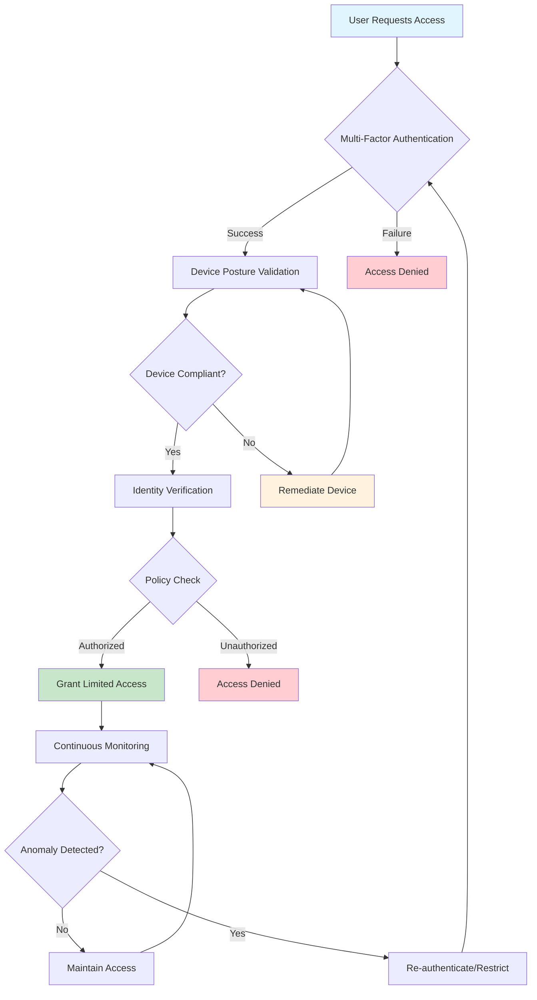
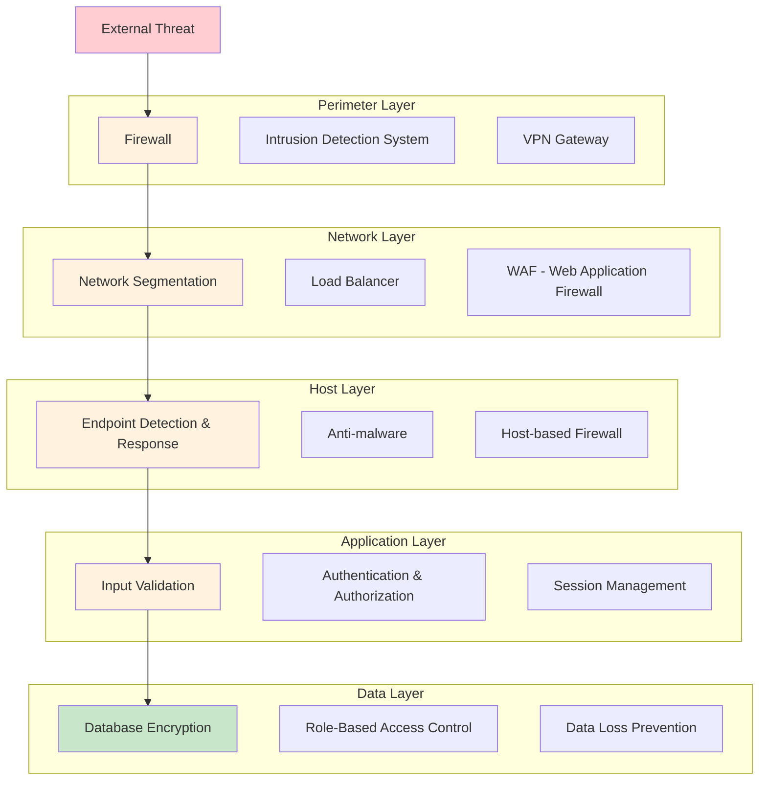
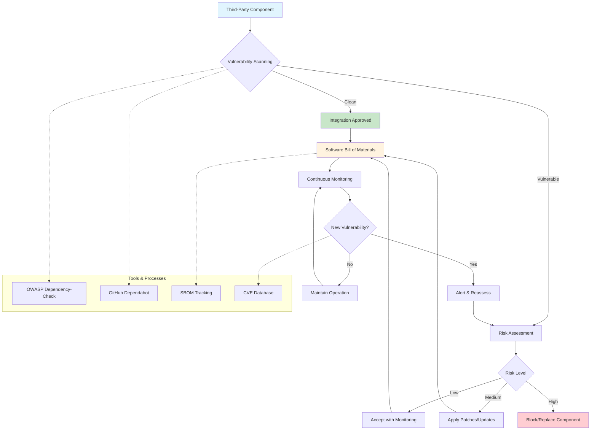
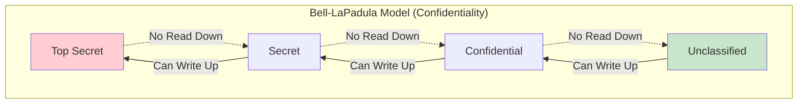
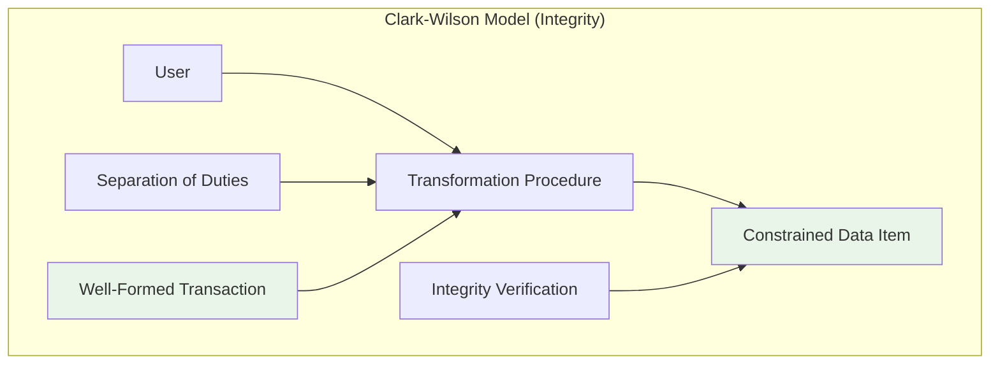
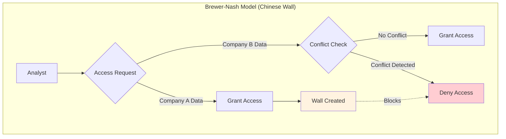

Implement and Explain Advanced Cybersecurity Defense Strategies

The project must demonstrate the application of Zero Trust Architecture by showing how access controls were enforced across at least 2 security layers. An explanation of Defense in Depth must be included, with at least 3 layers of defense clearly described and applied to a system architecture. Supply Chain Security must be demonstrated through documentation of 1 example where supply chain risks were identified and mitigated. The project must also describe 1 advanced security model, such as the Bell-LaPadula model or Clark-Wilson model, with an explanation of how it was applied to secure a system.

Implement Incident Response and Handling

The project must include an Incident Response Plan (IRP) that outlines a structured 5-step IR framework: preparation, identification, containment, eradication, and recovery. Digital forensics basics must be demonstrated by documenting the use of at least 1 forensic tool for data collection. Evidence collection and documentation must be supported by at least 2 forms of evidence (e.g., log files, screenshots) with proper chain of custody documentation. Incident triage and prioritization must be shown by categorizing 3 types of incidents based on severity and business impact. Post-incident analysis must be included, summarizing the incident outcome and describing at least 2 lessons learned.

Demonstrate SOC (Security Operations Center) Fundamentals

The project must explain SOC functions and operations by identifying at least 3 primary SOC roles and their responsibilities. Monitoring fundamentals must be demonstrated by configuring 1 monitoring tool and showcasing at least 2 types of network activity being monitored. Alert management must be shown with evidence of how 2 different security alerts were generated, investigated, and resolved. Basic threat detection must be demonstrated with an analysis of at least 1 identified threat and how it was detected using SOC tools.

Develop and Implement Security Policies and Governance

The project must include a policy development framework by providing a written security policy document covering at least 3 areas: access control, data protection, and system use policies. Governance structure must be demonstrated by outlining roles and responsibilities for enforcing the policy. Compliance requirements must be addressed with references to at least 1 security standard (e.g., ISO 27001, NIST CSF). Policy implementation must be demonstrated with evidence of how the security policies were communicated and enforced in a system.

Produce Effective Security Documentation

The project must include technical writing with a clearly written cybersecurity procedure document covering at least 1 security control implementation. Process documentation must be demonstrated with a documented step-by-step guide for at least 1 security task such as patch management or incident reporting. Security playbooks must be included, outlining at least 2 incident response scenarios with steps to follow. Knowledge base management must be demonstrated with a structured document repository containing at least 3 categorized resources for cybersecurity reference.

# Cybersecurity Basics 2

---

### 1. Implement and Explain Advanced Cybersecurity Defense Strategies  
- [ ] **1.1** Demonstrate **Zero Trust Architecture** by enforcing access controls across at least 2 security layers  
- [ ] **1.2** Explain and apply **Defense in Depth** with at least 3 layers of defense in a system architecture  
- [ ] **1.3** Demonstrate **Supply Chain Security** by documenting 1 example of risk identification and mitigation  
- [ ] **1.4** Describe and apply 1 **advanced security model**:  
  - [ ] **1.4a** Bell-LaPadula model  
  - [ ] **1.4b** Clark-Wilson model  
  - [ ] **1.4c** Other advanced security model (explanation + application to a system)  

---

### 1. Implement and Explain Advanced Cybersecurity Defense Strategies  

#### 1.1 Zero Trust Architecture (ZTA)  
- **Definition:** A security framework that requires continuous verification of users, devices, and applications, regardless of location within or outside the network perimeter.  
- **Implementation Example:**  
  1. **Identity Layer:** Enforce Multi-Factor Authentication (MFA) for all VPN logins.  
  2. **Network Layer:** Require device posture validation (up-to-date patches, endpoint protection enabled) before granting access to internal resources.  
- **Result:** Access is not granted based on network location alone, but on verified trust at multiple layers.  

---

#### 1.2 Defense in Depth (DiD)  
- **Definition:** A layered security approach where multiple security controls are implemented across the IT environment to reduce risk.  
- **Example System Architecture with 3 Layers:**  
  1. **Perimeter Layer:** Firewall + Intrusion Detection System (IDS).  
  2. **Host Layer:** Endpoint Detection & Response (EDR) with real-time monitoring.  
  3. **Application/Data Layer:** Database encryption and role-based access control (RBAC).  
- **Result:** Even if one defense fails (e.g., firewall bypass), additional layers continue to protect assets. 

---

---

#### 1.3 Supply Chain Security  
- **Definition:** Protecting systems from vulnerabilities or compromises introduced via third-party vendors, software, or hardware.  
- **Example of Risk Identification and Mitigation:**  
  - **Risk:** Open-source library used in a web app contains a known vulnerability (e.g., Log4j exploit).  
  - **Mitigation:**  
    - Perform regular dependency scanning (e.g., with OWASP Dependency-Check, GitHub Dependabot).  
    - Apply vendor patches and update vulnerable components immediately.  
    - Implement Software Bill of Materials (SBOM) tracking.  
- **Result:** Ensures that third-party risks are detected early and mitigated before exploitation.  

---

---

#### 1.4 Advanced Security Models  

##### 1.4a Bell-LaPadula Model (Confidentiality-Focused)  
- **Definition:** Enforces data confidentiality using security clearance levels.  
- **Application:** Used in military systems where users with "Secret" clearance cannot access "Top Secret" data, but can write upwards.  
- **Rule:** *"No Read Up, No Write Down"*.  

---

---

##### 1.4b Clark-Wilson Model (Integrity-Focused)  
- **Definition:** Ensures system integrity by enforcing separation of duties and well-formed transactions.  
- **Application:** Banking system enforces dual control — one employee enters a transaction, another must approve it.  
- **Rule:** Prevents unauthorized modifications and enforces integrity constraints.  

---

---

##### 1.4c Other Advanced Security Model – Brewer-Nash (Chinese Wall Model)  
- **Definition:** Prevents conflicts of interest by restricting access to data once a user accesses competing company data.  
- **Application:** In a consulting firm, an analyst working on "Company A" cannot access "Company B" financial data.  
- **Rule:** Protects against insider conflict-of-interest breaches.  

---

---

### 2. Implement Incident Response and Handling  
- [ ] **2.1** Create an **Incident Response Plan (IRP)** covering the 5-step framework:  
  - [ ] **2.1a** Preparation  
  - [ ] **2.1b** Identification  
  - [ ] **2.1c** Containment  
  - [ ] **2.1d** Eradication  
  - [ ] **2.1e** Recovery  
- [ ] **2.2** Demonstrate **digital forensics basics** with at least 1 forensic tool for data collection  
- [ ] **2.3** Collect and document evidence using at least 2 forms of evidence:  
  - [ ] **2.3a** Log files  
  - [ ] **2.3b** Screenshots  
  - [ ] **2.3c** Other evidence type  
- [ ] **2.4** Maintain proper **chain of custody documentation**  
- [ ] **2.5** Demonstrate **incident triage and prioritization** by categorizing 3 types of incidents based on severity and business impact  
- [ ] **2.6** Perform **post-incident analysis**:  
  - [ ] **2.6a** Summarize incident outcome  
  - [ ] **2.6b** Describe at least 2 lessons learned  

---

### 3. Demonstrate SOC (Security Operations Center) Fundamentals  
- [ ] **3.1** Explain **SOC functions and operations** by identifying at least 3 primary SOC roles and responsibilities  
- [ ] **3.2** Demonstrate **monitoring fundamentals**:  
  - [ ] **3.2a** Configure 1 monitoring tool  
  - [ ] **3.2b** Showcase at least 2 types of network activity being monitored  
- [ ] **3.3** Show **alert management** with evidence of how 2 different alerts were:  
  - [ ] **3.3a** Generated  
  - [ ] **3.3b** Investigated  
  - [ ] **3.3c** Resolved  
- [ ] **3.4** Demonstrate **basic threat detection** by analyzing at least 1 identified threat and showing how it was detected using SOC tools  

---

### 4. Develop and Implement Security Policies and Governance  
- [ ] **4.1** Provide a written **security policy document** covering at least 3 areas:  
  - [ ] **4.1a** Access control  
  - [ ] **4.1b** Data protection  
  - [ ] **4.1c** System use policies  
- [ ] **4.2** Demonstrate **governance structure** by outlining roles and responsibilities for enforcing the policy  
- [ ] **4.3** Address **compliance requirements** with references to at least 1 security standard (ISO 27001, NIST CSF, etc.)  
- [ ] **4.4** Demonstrate **policy implementation** with evidence of how policies were communicated and enforced in a system  

---

### 5. Produce Effective Security Documentation  
- [ ] **5.1** Create a **cybersecurity procedure document** covering at least 1 security control implementation  
- [ ] **5.2** Demonstrate **process documentation** with a step-by-step guide for at least 1 security task:  
  - [ ] **5.2a** Patch management  
  - [ ] **5.2b** Incident reporting  
  - [ ] **5.2c** Other task  
- [ ] **5.3** Include **security playbooks** outlining at least 2 incident response scenarios with steps to follow  
- [ ] **5.4** Demonstrate **knowledge base management** with a structured repository containing at least 3 categorized cybersecurity resources  
