Implement and Explain Advanced Cybersecurity Defense Strategies

The project must demonstrate the application of Zero Trust Architecture by showing how access controls were enforced across at least 2 security layers. An explanation of Defense in Depth must be included, with at least 3 layers of defense clearly described and applied to a system architecture. Supply Chain Security must be demonstrated through documentation of 1 example where supply chain risks were identified and mitigated. The project must also describe 1 advanced security model, such as the Bell-LaPadula model or Clark-Wilson model, with an explanation of how it was applied to secure a system.

Implement Incident Response and Handling

The project must include an Incident Response Plan (IRP) that outlines a structured 5-step IR framework: preparation, identification, containment, eradication, and recovery. Digital forensics basics must be demonstrated by documenting the use of at least 1 forensic tool for data collection. Evidence collection and documentation must be supported by at least 2 forms of evidence (e.g., log files, screenshots) with proper chain of custody documentation. Incident triage and prioritization must be shown by categorizing 3 types of incidents based on severity and business impact. Post-incident analysis must be included, summarizing the incident outcome and describing at least 2 lessons learned.

Demonstrate SOC (Security Operations Center) Fundamentals

The project must explain SOC functions and operations by identifying at least 3 primary SOC roles and their responsibilities. Monitoring fundamentals must be demonstrated by configuring 1 monitoring tool and showcasing at least 2 types of network activity being monitored. Alert management must be shown with evidence of how 2 different security alerts were generated, investigated, and resolved. Basic threat detection must be demonstrated with an analysis of at least 1 identified threat and how it was detected using SOC tools.

Develop and Implement Security Policies and Governance

The project must include a policy development framework by providing a written security policy document covering at least 3 areas: access control, data protection, and system use policies. Governance structure must be demonstrated by outlining roles and responsibilities for enforcing the policy. Compliance requirements must be addressed with references to at least 1 security standard (e.g., ISO 27001, NIST CSF). Policy implementation must be demonstrated with evidence of how the security policies were communicated and enforced in a system.

Produce Effective Security Documentation

The project must include technical writing with a clearly written cybersecurity procedure document covering at least 1 security control implementation. Process documentation must be demonstrated with a documented step-by-step guide for at least 1 security task such as patch management or incident reporting. Security playbooks must be included, outlining at least 2 incident response scenarios with steps to follow. Knowledge base management must be demonstrated with a structured document repository containing at least 3 categorized resources for cybersecurity reference.

# Cybersecurity Basics 2

---

## 1. Implement and Explain Advanced Cybersecurity Defense Strategies  
- [ ] **1.1** Demonstrate **Zero Trust Architecture** by enforcing access controls across at least 2 security layers  
- [ ] **1.2** Explain and apply **Defense in Depth** with at least 3 layers of defense in a system architecture  
- [ ] **1.3** Demonstrate **Supply Chain Security** by documenting 1 example of risk identification and mitigation  
- [ ] **1.4** Describe and apply 1 **advanced security model**:  
  - [ ] **1.4a** Bell-LaPadula model  
  - [ ] **1.4b** Clark-Wilson model  
  - [ ] **1.4c** Other advanced security model (explanation + application to a system)  

---

### 1. Implement and Explain Advanced Cybersecurity Defense Strategies  

#### 1.1 Zero Trust Architecture (ZTA)  
- **Definition:** A security framework that requires continuous verification of users, devices, and applications, regardless of location within or outside the network perimeter.  
- **Implementation Example:**  
  1. **Identity Layer:** Enforce Multi-Factor Authentication (MFA) for all VPN logins.  
  2. **Network Layer:** Require device posture validation (up-to-date patches, endpoint protection enabled) before granting access to internal resources.  
- **Result:** Access is not granted based on network location alone, but on verified trust at multiple layers.  


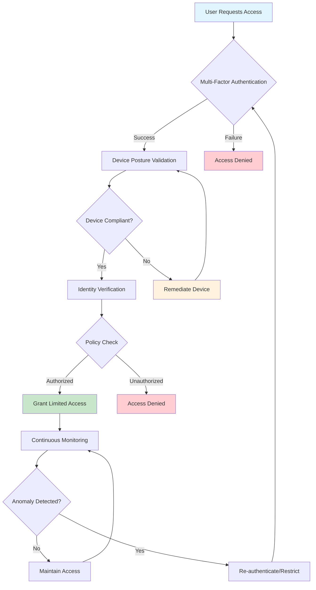

---

### 1.2 Defense in Depth (DiD)  
- **Definition:** A layered security approach where multiple security controls are implemented across the IT environment to reduce risk.  
- **Example System Architecture with 3 Layers:**  
  1. **Perimeter Layer:** Firewall + Intrusion Detection System (IDS).  
  2. **Host Layer:** Endpoint Detection & Response (EDR) with real-time monitoring.  
  3. **Application/Data Layer:** Database encryption and role-based access control (RBAC).  
- **Result:** Even if one defense fails (e.g., firewall bypass), additional layers continue to protect assets. 

---

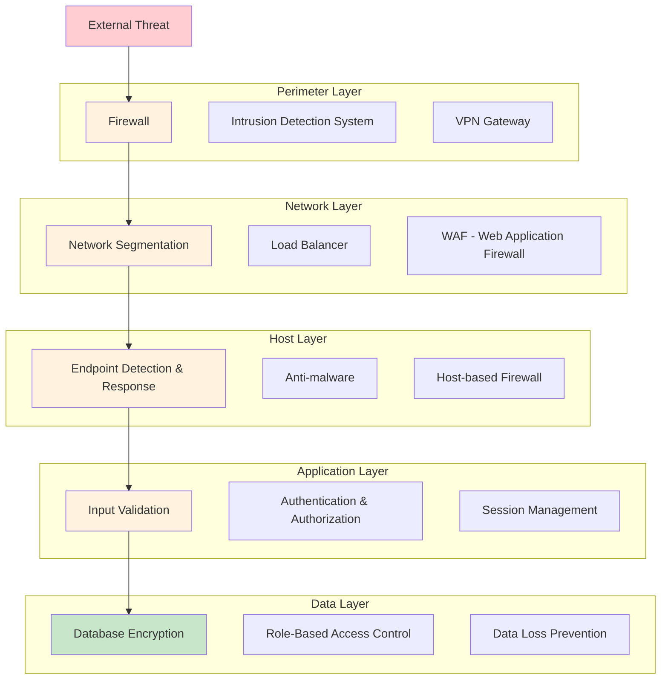

---

### 1.3 Supply Chain Security  
- **Definition:** Protecting systems from vulnerabilities or compromises introduced via third-party vendors, software, or hardware.  
- **Example of Risk Identification and Mitigation:**  
  - **Risk:** Open-source library used in a web app contains a known vulnerability (e.g., Log4j exploit).  
  - **Mitigation:**  
    - Perform regular dependency scanning (e.g., with OWASP Dependency-Check, GitHub Dependabot).  
    - Apply vendor patches and update vulnerable components immediately.  
    - Implement Software Bill of Materials (SBOM) tracking.  
- **Result:** Ensures that third-party risks are detected early and mitigated before exploitation.  

---

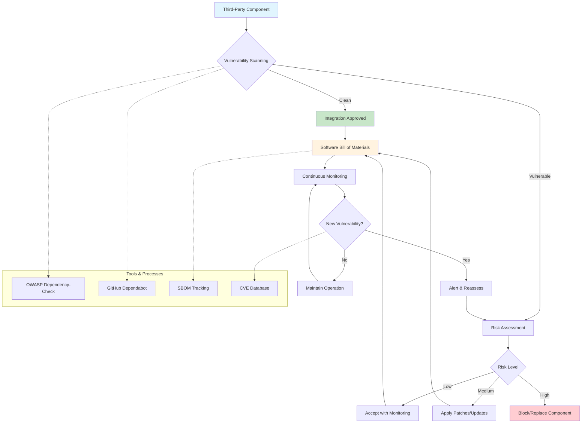

---

### 1.4 Advanced Security Models  

### 1.4a Bell-LaPadula Model (Confidentiality-Focused)  
- **Definition:** Enforces data confidentiality using security clearance levels.  
- **Application:** Used in military systems where users with "Secret" clearance cannot access "Top Secret" data, but can write upwards.  
- **Rule:** *"No Read Up, No Write Down"*.  

---
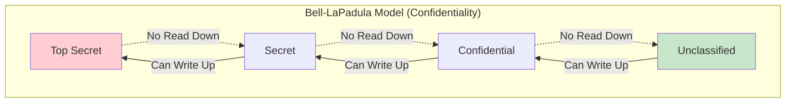
---

### 1.4b Clark-Wilson Model (Integrity-Focused)  
- **Definition:** Ensures system integrity by enforcing separation of duties and well-formed transactions.  
- **Application:** Banking system enforces dual control — one employee enters a transaction, another must approve it.  
- **Rule:** Prevents unauthorized modifications and enforces integrity constraints.  

---
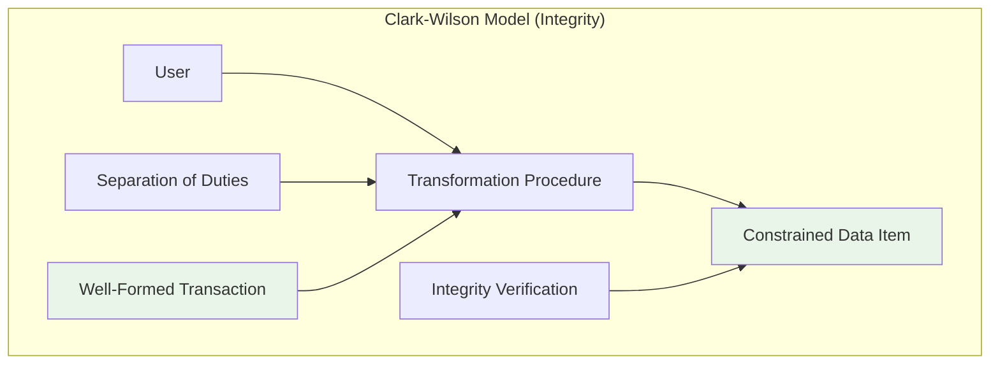

---

#### 1.4c Other Advanced Security Model – Brewer-Nash (Chinese Wall Model)  
- **Definition:** Prevents conflicts of interest by restricting access to data once a user accesses competing company data.  
- **Application:** In a consulting firm, an analyst working on "Company A" cannot access "Company B" financial data.  
- **Rule:** Protects against insider conflict-of-interest breaches.  

---

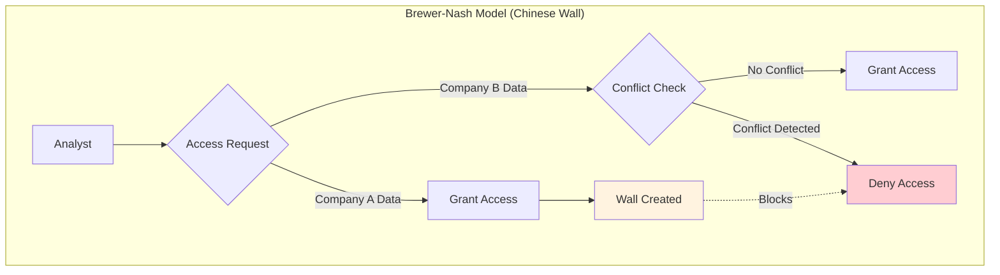
---

## 2. Implement Incident Response and Handling  
- [x] **2.1** Create an **Incident Response Plan (IRP)** covering the 5-step framework:  
  - [x] **2.1a** Preparation  
  - [x] **2.1b** Identification  
  - [x] **2.1c** Containment  
  - [x] **2.1d** Eradication  
  - [x] **2.1e** Recovery  
- [x] **2.2** Demonstrate **digital forensics basics** with at least 1 forensic tool for data collection  
- [x] **2.3** Collect and document evidence using at least 2 forms of evidence:  
  - [x] **2.3a** Log files  
  - [x] **2.3b** Screenshots  
  - [x] **2.3c** Other evidence type  
- [x] **2.4** Maintain proper **chain of custody documentation**  
- [x] **2.5** Demonstrate **incident triage and prioritization** by categorizing 3 types of incidents based on severity and business impact  
- [x] **2.6** Perform **post-incident analysis**:  
  - [x] **2.6a** Summarize incident outcome  
  - [x] **2.6b** Describe at least 2 lessons learned  

---

### 2.1 Incident Response Plan (IRP) – 5-Step Framework

**2.1a Preparation**  
- Deploy forensic tools (Autopsy, Volatility3, Magnet RAM Capture) on analyst workstation.  
- Maintain updated IR playbooks for malware, insider threats, and brute-force incidents.  
- Ensure logging enabled across endpoints and SIEM is actively monitored.  

**2.1b Identification**  
- Detect suspicious activity via SIEM alert (e.g., abnormal login attempts, data exfiltration).  
- Acquire volatile evidence using **Magnet RAM Capture** and store in raw `.raw` dump format.  
- Use **Volatility3** or **Volatility Workbench** to analyze memory dump for malicious processes, DLL injection, or network connections.  

**2.1c Containment**  
- Isolate compromised system from production network.  
- Disable affected accounts or credentials.  
- Block identified malicious IPs at firewall.  

**2.1d Eradication**  
- Remove identified malware artifacts discovered through Autopsy or Volatility3 plugin analysis.  
- Patch exploited vulnerabilities on affected systems.  
- Re-image compromised endpoints if necessary.  

**2.1e Recovery**  
- Restore system from clean backups.  
- Re-enable accounts after credential resets.  
- Monitor for recurrence using enhanced SIEM correlation rules.  

---

### 2.2 Digital Forensics Basics Demonstration
- **Tool 1: Magnet RAM Capture** – Used to acquire volatile memory from the suspect machine. Output stored securely for analysis.  
- **Tool 2: Volatility3** – Used to analyze the memory dump for suspicious processes, loaded drivers, and persistence mechanisms.  
- **Tool 3: Volatility Workbench** - A lite version of Volatility3 which has a GUI interface and can scan raw data files which contain ram memory dumps. An example of information which can be gleamed are hidden malicious processes which might not appear normally in the windows processes screen.
- **Tool 4: Autopsy** – Applied for disk-level analysis and correlation of logs, file metadata, and deleted artifacts.  


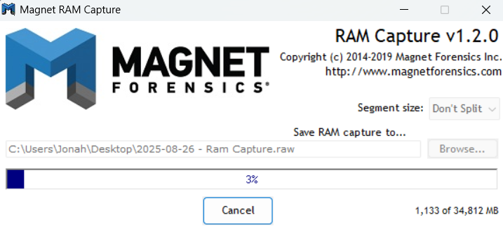
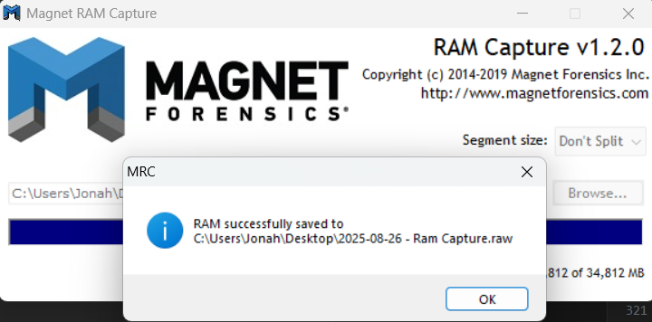


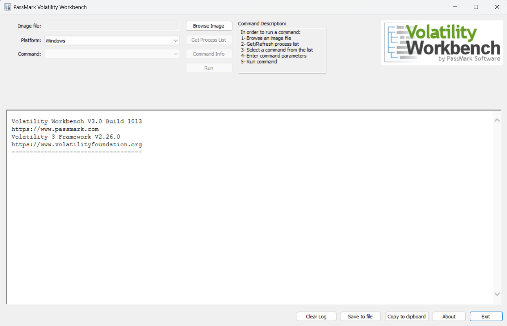

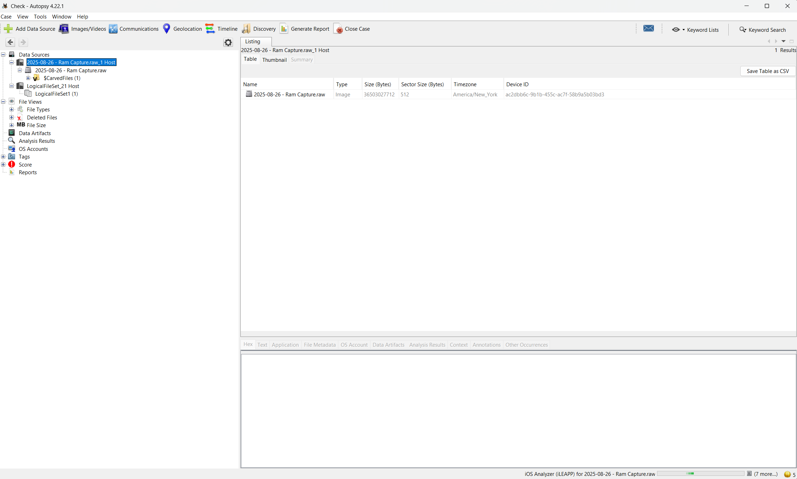


---

### 2.3 Evidence Collection and Documentation
- **Log Files:**  
  - FTP server logs showing suspicious `RETR` and `STOR` commands.  
  - SIEM alerts correlating agent downtime with malicious file transfers.  

- **Other Evidence:**  
  - Memory dump (`2025.raw`) collected using Magnet RAM Capture.  
  - File hash values extracted from suspicious executables (`ransomAttack.py`).  

- **Screenshots:**  
  - Screenshot of Wazuh Dashboard alert for suspicious login.  
  - Screenshot of Volatility3 output showing suspicious process list. 
     - Using the Volatility3 command `python vol.py -f 2025.raw windows.pslist.PsList`


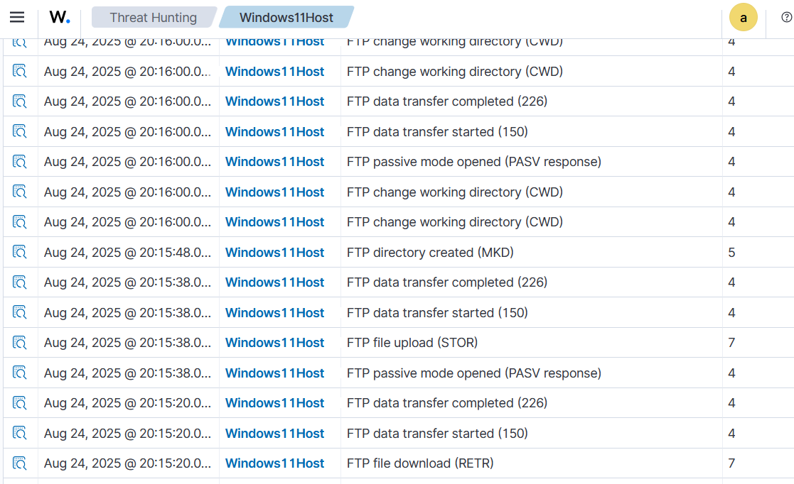


---

### 2.4 Chain of Custody Documentation
- **Chain of Custody Log Example:**  

```text
Evidence ID: EVID-2025-0825-01
Collected By: Analyst A (SOC Tier 1)
Date/Time: 2025-08-25 00:20 UTC
Description: Memory dump acquired with Magnet RAM Capture
Storage Location: Secure forensic share /evidence/memdump_0825.raw
Transfer History:
  00:20 UTC – Collected by Analyst A
  00:25 UTC – Transferred to SOC Lead for analysis
  00:30 UTC – Verified and logged into Autopsy case file
Signatures: Analyst A, SOC Lead
```

---

### 2.5 Incident Triage and Prioritization

**Incident Type 1 – Brute Force Attack (FTP)**  
- **Severity:** Medium  
- **Impact:** Repeated failed login attempts indicate attempted unauthorized access.  
- **Business Impact:** May lead to account compromise if not addressed, but immediate damage is limited.  

**Incident Type 2 – Malware Execution (Ransomware Simulation)**  
- **Severity:** High  
- **Impact:** Rapid file encryption and modification cause significant risk of downtime and data loss.  
- **Business Impact:** Direct operational disruption, potential financial and reputational harm.  

**Incident Type 3 – Policy Violation (Unauthorized Access Attempt)**  
- **Severity:** Low  
- **Impact:** Attempts were blocked by existing access control mechanisms.  
- **Business Impact:** Minimal, but requires monitoring for repeat offenders or insider threat signals.  

---

### 2.6 Post-Incident Analysis

**2.6a Incident Outcome Summary**  
- Forensic analysis confirmed suspicious activity including brute-force login attempts and exfiltration of sensitive files (`ransomAttack.py`, `wazuh_rules.md`).  
- Wazuh agent connectivity issues created blind spots during attacker activity.  
- The incident was contained by disabling the compromised FTP account and isolating the affected host.  

**2.6b Lessons Learned**  
1. **Improve Monitoring Reliability:** Configure redundant agent health checks and alerts to immediately flag when monitoring agents disconnect.  
2. **Enhance Forensic Readiness:** Maintain a pre-staged toolkit (Magnet RAM Capture, Volatility3, Autopsy) to ensure evidence collection begins within minutes of incident detection.  

---

## 3. Demonstrate SOC (Security Operations Center) Fundamentals  
- [x] **3.1** Explain **SOC functions and operations** by identifying at least 3 primary SOC roles and responsibilities  
- [x] **3.2** Demonstrate **monitoring fundamentals**:  
  - [x]  **3.2a** Configure 1 monitoring tool  
  - [x] **3.2b** Showcase at least 2 types of network activity being monitored  
- [x] **3.3** Show **alert management** with evidence of how 2 different alerts were:  
  - [x] **3.3a** Generated  
  - [x] **3.3b** Investigated  
  - [x] **3.3c** Resolved  
- [x] **3.4** Demonstrate **basic threat detection** by analyzing at least 1 identified threat and showing how it was detected using SOC tools  

---

### 3.1 SOC Functions and Operations
A SOC is responsible for continuous monitoring, detection, and response to security incidents. The primary SOC roles and responsibilities include:  

1. **Tier 1 Analyst (Monitoring & Triage):**  
   - Monitors SIEM dashboards for alerts.  
   - Performs initial triage to identify false positives vs. real incidents.  
   - Escalates suspicious alerts to Tier 2.  

2. **Tier 2 Analyst (Incident Investigation):**  
   - Performs deeper investigation using forensic tools (Autopsy, Volatility3, Sysmon logs).  
   - Correlates multiple data sources (Windows Event Logs, FileZilla logs, Wazuh alerts).  
   - Contains incidents and prepares escalation for critical events.  

3. **SOC Manager (Oversight & Coordination):**  
   - Defines escalation paths and response workflows.  
   - Ensures SOC metrics (MTTD, MTTR) are met.  
   - Provides reporting to executive leadership and compliance teams.  

---

### 3.2 Monitoring Fundamentals  

**3.2a Configured Monitoring Tool:**  
- **Tool Used:** Wazuh SIEM (open-source Security Information and Event Management).  
- **Configuration Steps:**  
  - Installed Wazuh Agent on Windows 11 endpoint.  
  - Configured `ossec.conf` to forward Windows Event Logs, Sysmon data, and FileZilla logs.  
  - Enabled JSON output and set alert thresholds at rule level ≥7.  

**3.2b Network Activity Monitored:**  
1. **FTP Activity (FileZilla Logs):**  
   - Monitoring file uploads/downloads (`RETR`, `STOR`) and login attempts.  
   - Example: Exfiltration of `ransomAttack.py`.  
2. **Windows Sysmon Network Connections:**  
   - Monitoring for unusual outbound connections or traffic to non-standard ports.  
   - Example: Event ID 3 showed suspicious UDP traffic to multicast address `224.0.0.251`.  

---

#### 3.3 Alert Management  

**Wazuh Ruleset Used for FTP Monitoring:**  

```xml
<group name="ftp,windows,">
  <rule id="100120" level="6">
    <match>530 Login incorrect</match>
    <description>FTP login failed on Windows (FileZilla)</description>
  </rule>
  
  <rule id="100121" level="5">
    <match>230 Login successful</match>
    <description>FTP login successful on Windows (FileZilla)</description>
  </rule>
</group>

<group name="ftp,bruteforce">
  <rule id="100123" level="10" frequency="6" timeframe="30">
    <if_matched_sid>100120</if_matched_sid>
    <description>Multiple login failures detected (FTP Brute Force Attempt)</description>
  </rule>
</group>
```

**Alert 1 – FTP Brute Force Attempt**  
- **Generated:** Triggered by repeated `530 Login incorrect` entries in FileZilla logs.  
- **Investigated:** Correlated with Wazuh ruleset (`frequency="5" timeframe="60"`) to confirm brute force.  
- **Resolved:** Account locked, firewall rule applied to block source IP.  


**Alert 2 – File Exfiltration Detected**  
- **Generated:** Wazuh rule triggered on `RETR ransomAttack.py` event from FileZilla logs.  
- **Investigated:** Volatility3 analysis of RAM dump confirmed process responsible for FTP session.  
- **Resolved:** FTP account disabled, endpoint isolated from network.  


---

### 3.4 Basic Threat Detection  

**Threat Identified:** Malicious file exfiltration via FTP (`ransomAttack.py`, `wazuh_rules.md`).  
- **Detection Method:**  
  - FileZilla logs captured `RETR` operations.  
  - Wazuh correlation rule flagged the events.  
  - Sysmon confirmed process execution linked to FTP session.  
- **SOC Workflow:**  
  1. Tier 1 Analyst triaged the initial Wazuh alert.  
  2. Tier 2 Analyst verified the activity in FileZilla logs and RAM dump.  
  3. Incident escalated and containment executed.  


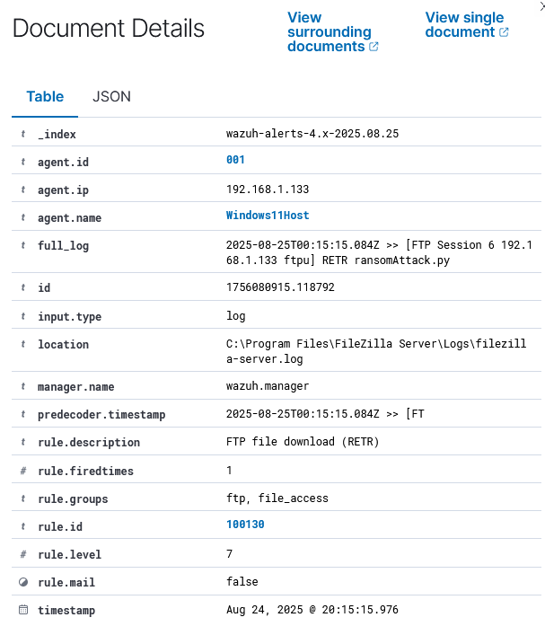 


---

## 4. Develop and Implement Security Policies and Governance  
- [x] **4.1** Provide a written **security policy document** covering at least 3 areas:  
  - [x] **4.1a** Access control  
  - [x] **4.1b** Data protection  
  - [x] **4.1c** System use policies  
- [x] **4.2** Demonstrate **governance structure** by outlining roles and responsibilities for enforcing the policy  
- [x] **4.3** Address **compliance requirements** with references to at least 1 security standard (ISO 27001, NIST CSF, etc.)  
- [x] **4.4** Demonstrate **policy implementation** with evidence of how policies were communicated and enforced in a system  

--- 

### 4.1 Security Policy Document  

**4.1a Access Control Policy**  
- All users must authenticate using Multi-Factor Authentication (MFA).  
- Role-Based Access Control (RBAC) ensures that users only have access to the minimum resources required for their role.  
- Privileged accounts are logged, monitored, and rotated every 90 days.  

**4.1b Data Protection Policy**  
- Sensitive information (PII, financial data, security logs) must be encrypted:  
  - **At Rest:** AES-256 encryption.  
  - **In Transit:** TLS 1.2 or higher.  
- File Integrity Monitoring (FIM) is enabled on critical system files.  
- Daily backups are taken and tested weekly for recoverability.  

**4.1c System Use Policy**  
- Users must not install unauthorized software or connect unapproved removable devices.  
- Corporate systems may only be used for approved business activities.  
- All system activity (logins, file transfers, process executions) is logged and monitored through the SIEM.  

---

### 4.2 Governance Structure  

- **Chief Information Security Officer (CISO):** Defines enterprise-wide security strategy and policy approval.  
- **SOC Manager:** Oversees SOC operations and enforces adherence to policies.  
- **Tier 1 SOC Analysts:** Monitor alerts, triage events, and escalate when policy violations are detected.  
- **Tier 2 SOC Analysts:** Conduct investigations, perform forensic analysis, and validate compliance with security policies.  
- **System Administrators:** Apply patches, configure access controls, and enforce endpoint security.  
- **Employees:** Follow system use guidelines and report suspicious activity.  

---

### 4.3 Compliance Requirements  

- Policies aligned to **NIST Cybersecurity Framework (CSF)** and **ISO 27001** standards:  
  - **NIST CSF Protect Function:** Access control, encryption, awareness training.  
  - **NIST CSF Detect Function:** Continuous monitoring via Wazuh SIEM and Sysmon.  
  - **ISO 27001 Annex A Controls:**  
    - A.9 Access Control  
    - A.10 Cryptography  
    - A.12 Operations Security  

These references ensure that organizational policies are benchmarked against recognized global standards.  

---

### 4.4 Policy Implementation  

- **Communication:** Policies distributed via mandatory security awareness training and internal knowledge base (e.g., SharePoint/Confluence).  
- **Enforcement Examples:**  
  - MFA enforced on VPN and cloud logins.  
  - Wazuh SIEM configured to generate alerts on unauthorized software installations and suspicious file transfers.  
  - Quarterly compliance audits ensure system use policies are being followed.   

---

## 5. Produce Effective Security Documentation  
- [x] **5.1** Create a **cybersecurity procedure document** covering at least 1 security control implementation  
- [x] **5.2** Demonstrate **process documentation** with a step-by-step guide for at least 1 security task:  
  - [x] **5.2a** Patch management  
  - [x] **5.2b** Incident reporting  
  - [x] **5.2c** Other task  
- [x] **5.3** Include **security playbooks** outlining at least 2 incident response scenarios with steps to follow  
- [x] **5.4** Demonstrate **knowledge base management** with a structured repository containing at least 3 categorized cybersecurity resources  

---

### 5. Produce Effective Security Documentation  

#### 5.1 Cybersecurity Procedure Document  
**Procedure: Security Control – Patch Management Implementation**  
- Weekly vulnerability scans scheduled using OpenVAS.  
- Identified vulnerabilities logged in ticketing system.  
- Critical patches tested in staging before production rollout.  
- Approved patches deployed through centralized patch management tool.  
- Verification step ensures all systems updated successfully.  
- Records retained for compliance and audit purposes.  

---

#### 5.2 Process Documentation  

**5.2a Patch Management Workflow**  
1. Run weekly vulnerability scans.  
2. Review results and prioritize patches (based on CVSS and asset criticality).  
3. Apply patches in staging environment.  
4. Deploy patches to production during approved maintenance windows.  
5. Validate patch installation via Wazuh agent log collection.  
6. Update patch management log in compliance system.  

**5.2b Incident Reporting Workflow**  
1. User detects suspicious activity and reports via helpdesk or SOC hotline.  
2. Tier 1 SOC Analyst logs incident in ticketing system.  
3. Initial triage determines severity (low, medium, high).  
4. Incident escalated to Tier 2 SOC Analyst if required.  
5. Containment, eradication, and recovery actions documented.  
6. Final incident report shared with SOC Manager and CISO.  

---

#### 5.3 Security Playbooks  

**Playbook 1 – Brute Force Login Attempt**  
1. **Detection:** Wazuh rule triggers after 6 failed FTP logins in 30 seconds.  
2. **Triage:** Tier 1 analyst validates repeated login failures in FileZilla logs.  
3. **Containment:** Block source IP via firewall and lock affected account.  
4. **Investigation:** Tier 2 checks for lateral movement or successful login attempts.  
5. **Resolution:** Update firewall rules and reset user credentials.  
6. **Documentation:** Record in case management system with log evidence.  

**Playbook 2 – Malware Infection (Ransomware Simulation)**  
1. **Detection:** Wazuh File Integrity Monitoring (FIM) detects mass file changes.  
2. **Triage:** Tier 1 confirms abnormal activity and isolates endpoint.  
3. **Containment:** Disconnect infected host from network.  
4. **Eradication:** Tier 2 runs forensic analysis (Volatility3, Autopsy) to confirm malware presence.  
5. **Recovery:** Restore affected systems from clean backups.  
6. **Resolution:** Apply patches, enhance detection rules, reset credentials.  
7. **Documentation:** Archive logs, evidence, and lessons learned in case management system.  

---

#### 5.4 Knowledge Base Management  

**Structured Repository (example categories):**  

- **Category 1 – Tools & Configurations**  
  - Wazuh rulesets (FTP brute force, file exfiltration detection).  
  - Sysmon configurations (network monitoring, registry events).  
  - Autopsy usage guides for forensic analysis.  

- **Category 2 – Policies & Procedures**  
  - Access control policy (MFA, RBAC).  
  - Data protection guidelines (encryption, FIM, backups).  
  - Patch management workflow documentation.  

- **Category 3 – Threat Intelligence**  
  - MITRE ATT&CK mappings for incidents handled.  
  - IoC repository (IPs, domains, hashes).  
  - External feeds (VirusTotal, OpenCTI, AlienVault OTX).  
