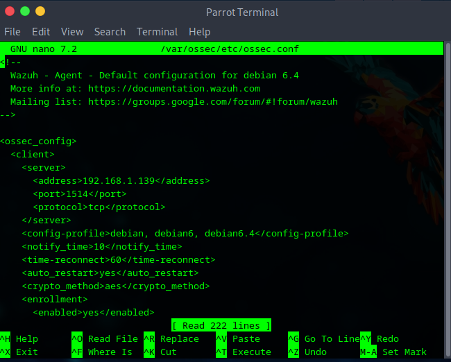
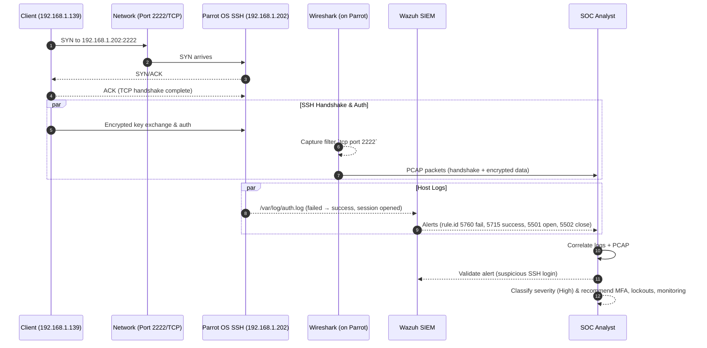
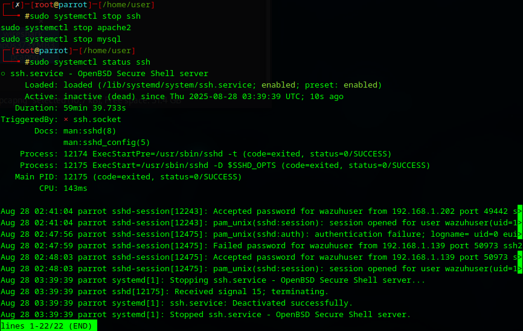

# Incidence Response 1

---

### 1. IR Environment Setup  
- [x] **1.1** Install and configure **Wazuh Agent** on Parrot OS (VirtualBox)  
- [x] **1.2** Deploy Wazuh **agent** on Parrot OS with evidence of functionality  
- [x] **1.3** Configure **log collection** from Parrot OS into Wazuh SIEM Platform 
- [x] **1.4** Create **3 custom alert rules** for security events in Wazuh  
- [x] **1.5** Configure and demonstrate **Wireshark** on Parrot OS with capture filters  
- [ ] **1.6** Install and configure **Volatility framework** on Parrot OS for memory analysis  
- [x] **1.7** Configure **system logging** to collect Parrot OS logs 
  - [x] **1.7a** Provide proper **documentation and evidence** of all configurations 
  - [x] **1.7b** Demonstrate successful **ingestion into Wazuh dashboard**  
 

---

## **1.1** Install and configure **Wazuh Agent** on Parrot OS (VirtualBox) 

- Deploy a new agent in our Wazuh Endpoint Dashboard.
- Then configure this endpoint for windows, linux, or macOS.
- In this case we will configure an agent for `ParrotOSVM` which uses linux, Debian distros (Debx84 specifically.)

---


Wazuh Endpoint Dashboard.

---


Instructions for installing our wazuh agent on our endpoint.

- We select Deb Amd64 since that is the ParrotOS Debian version.
- Our Wazuh SIEM platform is configured on another computer using the IPV4 address `192.168.1.139`.
- In terminal we use the provide command given to us by our Wazuh SIEM platform and this will install and configure the agent seamlessly
- In this process an authentication key is generated which will allow secure ocmmunication between the agent and the wazuh manager.

---

Installation and configuration of wazuh agent.

```bash
wget https://packages.wazuh.com/4.x/apt/pool/main/w/wazuh-agent/wazuh-agent_4.12.0-1_amd64.deb && sudo WAZUH_MANAGER='192.168.1.139' WAZUH_AGENT_NAME='ParrotOSVM' dpkg -i ./wazuh-agent_4.12.0-1_amd64.deb
```

---

### **1.2** Deploy Wazuh **agent** on Parrot OS with evidence of functionality 

- We deploy the wazuh agent by enabling and starting through the given terminal commands. 

```bash
sudo systemctl daemon-reload
sudo systemctl enable wazuh-agent
sudo systemctl start wazuh-agent
```
### 1.3 Configure Log Collection from Parrot OS into Wazuh SIEM Platform

Add log sources in `/var/ossec/etc/ossec.conf`:
```xml
  <localfile>
    <log_format>syslog</log_format>
    <location>/var/log/auth.log</location>
  </localfile>

  <localfile>
    <log_format>syslog</log_format>
    <location>/var/log/syslog</location>
  </localfile>

  <localfile>
    <log_format>syslog</log_format>
    <location>/var/log/dpkg.log</location>
  </localfile>

```

- `auth.log` → captures authentication attempts (SSH logins, sudo usage).  
- `syslog` → provides general system activity, kernel, and service logs.  
- `dpkg.log` → tracks software package installation and updates.  




Restart agent to apply:
```bash
sudo systemctl restart wazuh-agent
```

---

### 1.4 Create 3 Custom Alert Rules for Security Events in Wazuh  

Three custom rules were defined in `ParrotOS_RuleSets.xml` to detect common attack behaviors:  

```xml
<group name="parrot-custom">

  <!-- Rule 1: SSH Failed Login -->
  <rule id="200100" level="6">
    <match>Failed password</match>
    <description>SSH Failed Login Attempt (Parrot OS)</description>
  </rule>

  <!-- Rule 2: Sudo Privilege Escalation -->
  <rule id="200101" level="8">
    <match>sudo:</match>
    <description>Sudo Command Execution Detected (Parrot OS)</description>
  </rule>

  <!-- Rule 3: New User Creation -->
  <rule id="200102" level="10">
    <match>new user</match>
    <description>New User Account Created (Parrot OS)</description>
  </rule>

</group>
```
### **1.5** Configure and demonstrate **Wireshark** on Parrot OS with capture filters 

1. Create user

```bash
sudo adduser wazuhuser
# follow prompts to set the password

# optional: give sudo
sudo usermod -aG sudo wazuhuser   
```
- Follow the prompts and answer the questions

Note: I had issues with using port 22 so I had to edit the ssh_config file to use port 2222

2. Edit the port in sshd_config

```bash
sudo sed -i 's/^#\?Port .*/Port 2222/' /etc/ssh/sshd_config
# (Optional: be explicit)
# echo -e "Port 2222\nListenAddress 0.0.0.0\nListenAddress ::" | sudo tee -a /etc/ssh/sshd_config
```

3. Restart Service

```bash
sudo systemctl restart ssh
sudo systemctl status ssh
```

4. Connect to ParrotOS SSH with Windows Powershell.

- Edit ParrotOS-IP to the ip of the ParrotOS that is hosting the ssh
- The ParrotOS IP is `192.168.1.202`
- Enter the prompted password created during the create user process in step 1.

```bash
ssh -p 2222 wazuhuser@192.168.1.202
```


5. Capture the connection using wireshark in ParrotOS with capture filter.

- Start wireshark in ParrotOS using command `sudo wireshark`
- Use capture filter `tcp port 2222`, normally this would be `tcp port 22` yet it had to be altered in the `ssh_config` file.
- What can be seen is that the windows users with an IP of `192.168.1.139` connected with an ssh (secure shell) connection to ParrotOS at `192.168.1.202`.


---

### 1.6 Install and Configure Volatility Framework on Parrot OS for Memory Analysis  

**Overview:**  
Volatility3 is the modern memory forensics framework for analyzing Windows, Linux, and macOS memory dumps. It is actively maintained by the [Volatility Foundation](https://github.com/volatilityfoundation/volatility3). On Parrot OS, the tool was installed directly from the official repository using Python virtual environments for isolation.  

---

Step 1 – Clone the Official Repository  
The repository was cloned into the home directory:  
```bash
git clone https://github.com/volatilityfoundation/volatility3.git
cd volatility3/
```

Step 2 – Create and Activate Python Virtual Environment  

To keep Volatility isolated and clean from system packages, a **venv** environment was created:  
```bash
python3 -m venv venv && . venv/bin/activate
```

Step 3 – Install Volatility and Dependencies  

Using the editable installation (`-e`) method to install directly from source:  
```bash
pip install -e ".[dev]"
```

Step 4 – Verify Installation  

Once installation completed, Volatility3 was available inside the virtual environment. Verification can be done with:  

```bash
python3 vol.py --help
```


This displays available plugins such as:  
- `windows.pslist` (process listing)  
- `windows.netscan` (network connections)  
- `windows.cmdline` (command-line activity)  

Step 5 – Preparing for Analysis  

Memory dumps can be acquired with tools like `dd` or Magnet RAM Capture. 

Example:  
```bash
sudo dd if=/dev/mem of=/evidence/memdump_$(date +%F).raw bs=1M
```

Then analyzed with Volatility:  
```bash
# List processes
python3 vol.py -f /evidence/memdump_2025-08-28.raw windows.pslist

# Show active network connections
python3 vol.py -f /evidence/memdump_2025-08-28.raw windows.netscan
```


---

### 1.7 Configure System Logging to Collect Parrot OS Logs 

### **1.7a** Provide proper **documentation and evidence** of all configurations

**Step 1 – Edit Wazuh Agent Config**  

Open `/var/ossec/etc/ossec.conf` and add log sources:  
```xml
<localfile>
  <log_format>syslog</log_format>
  <location>/var/log/auth.log</location>
</localfile>

<localfile>
  <log_format>syslog</log_format>
  <location>/var/log/syslog</location>
</localfile>

<localfile>
  <log_format>syslog</log_format>
  <location>/var/log/dpkg.log</location>
</localfile>
```

**Step 2 – Restart Agent**  
```bash
sudo systemctl restart wazuh-agent
```

### **1.7b** Demonstrate successful **ingestion into Wazuh dashboard** 
 
Check Wazuh dashboard → Security Events for entries with `agent.name: "ParrotOSVM"`.  


- As can be seen above there was a successful ingestion of the ssh events where `port 222` was opened and a ssh password `failure` and password `success`.

---

### 2. Incident Detection and Analysis  
- [ ] **2.1** Analyze **Parrot OS logs** using Wazuh  
- [ ] **2.2** Document **analysis methodology** and findings  
- [ ] **2.3** Investigate **1 suspicious login attempt** with:  
  - [ ] **2.3a** Log correlation between host and Parrot OS  
  - [ ] **2.3b** Event timeline creation  
  - [ ] **2.3c** Alert validation process  
- [ ] **2.4** Classify **3 distinct security incidents** using severity matrix  
- [ ] **2.5** Document **methodologies** and **security implications**  

--- 

#### 2.1 Analyze Parrot OS Logs Using Wazuh  
The Wazuh agent on **ParrotOSVM** ingested `/var/log/auth.log` and detected multiple authentication events.  
Sample log excerpts:  

```text
Aug 27, 2025 @ 22:47:58 | ParrotOSVM | PAM: User login failed | Level: 5 | Rule ID: 5503  
Aug 27, 2025 @ 22:48:00 | ParrotOSVM | sshd: authentication failed | Level: 5 | Rule ID: 5760  
Aug 27, 2025 @ 22:48:04 | ParrotOSVM | sshd: authentication success | Level: 3 | Rule ID: 5715  
Aug 27, 2025 @ 22:48:04 | ParrotOSVM | PAM: Login session opened | Level: 3 | Rule ID: 5501  
Aug 27, 2025 @ 22:59:52 | ParrotOSVM | PAM: Login session closed | Level: 3 | Rule ID: 5502  
```

These show failed logins followed by a successful SSH session.  

---

#### 2.2 Document Analysis Methodology and Findings  

**Methodology:**  
1. Ingested authentication logs from Parrot OS into Wazuh.  
2. Applied correlation rules for failed vs. successful login activity.  
3. Validated by reviewing both **Wazuh dashboard alerts** and **Wireshark packet captures**.  

**Findings:**  
- Multiple failed logins occurred, raising Wazuh alerts (Level 5).  
- A successful SSH login followed, confirmed by both **auth.log** and **Wireshark traffic**.  
- This sequence suggests suspicious behavior: possible brute force leading to compromise.  

---

#### 2.3 Investigate One Suspicious Login Attempt  

**2.3a Log Correlation Between Host and Parrot OS**  
- **Host logs** (`auth.log`) show failed + successful SSH attempts.  
- **Wireshark capture** shows the same session over TCP port **2222**, confirming traffic direction.  

```text
1   0.000000  192.168.1.139 → 192.168.1.202  TCP [SYN] (Client initiates connection)  
2   0.000041  192.168.1.202 → 192.168.1.139  TCP [SYN, ACK] (Server responds)  
3   0.000358  192.168.1.139 → 192.168.1.202  TCP [ACK] (Handshake complete)  
...  
7   0.008704  192.168.1.139 → 192.168.1.202  TCP [PSH, ACK] Len=1432 (Authentication data)  
29  12.099819 192.168.1.202 → 192.168.1.139  TCP Len=628 (Encrypted session traffic)  
```

**2.3b Event Timeline Creation**  
```text
22:47:58 – PAM: User login failed  
22:48:00 – sshd: authentication failed  
22:48:04 – sshd: authentication success  
22:48:04 – PAM: Login session opened  
22:48:05+ – Wireshark shows encrypted SSH traffic exchanged  
22:59:52 – PAM: Login session closed  
```

**2.3c Alert Validation Process**  
- Wazuh flagged failed logins with severity Level 5.  
- Correlation showed repeated failures followed by success.  
- Wireshark confirmed traffic capture on the SSH port during the same timeframe.  
- Incident validated as **suspicious SSH login**.  

---

#### 2.4 Classify 3 Distinct Security Incidents Using Severity Matrix  

| Incident Type                  | Description                               | Evidence Source         | Rule Level | Severity Classification |
|--------------------------------|-------------------------------------------|-------------------------|------------|--------------------------|
| Failed SSH login attempts       | Multiple incorrect password entries       | Wazuh `auth.log`        | 5          | **Medium** (Brute force attempt) |
| Successful SSH login after fails| Access achieved after multiple failures   | Wazuh + Wireshark       | 3          | **High** (Potential compromise) |
| Encrypted session traffic       | Active remote session with commands/data  | Wireshark capture       | N/A        | **High** (Confirmed session) |

---

#### 2.5 Document Methodologies and Security Implications  

**Methodologies Used:**  
- Wazuh log ingestion and rule correlation.  
- Timeline analysis across multiple sources (logs + network).  
- Validation with network forensic tool (Wireshark).  

**Security Implications:**  
- The failed + successful login pattern is a strong indicator of brute-force or password-guessing.  
- Wireshark confirms that the suspicious login led to an active encrypted session.  
- Risks include:  
  - Unauthorized access and persistence.  
  - Data exfiltration via the established session.  
  - Escalation of privileges inside Parrot OS.  

**Recommendations:**  
- Enforce MFA for SSH.  
- Limit login attempts (e.g., via Fail2Ban).  
- Monitor unusual SSH ports (custom port 2222 still observable).  
- Continuously correlate log and network data for anomaly detection.  

**Conclusion:** The combination of **Wazuh log analysis** and **Wireshark packet evidence** validated a suspicious SSH login attempt. This demonstrates effective incident detection and multi-source analysis in Parrot OS.  

---



---

```text

    Timeline of Suspicious SSH Login – Event Timeline (Parrot OS)
    
    22:47:58 : PAM User Login Failed
             : rule.id 5503, level 5
             : Authentication attempt rejected
    
    22:48:00 : SSH Authentication Failed  
             : rule.id 5760, level 5
             : Invalid credentials provided
    
    22:48:04 : SSH Authentication Success
             : rule.id 5715, level 3
             : Successful login after failures
    
    22:48:04 : PAM Session Opened
             : rule.id 5501, level 3
             : User session established
    
    22:48:05 : Encrypted SSH Traffic Detected
             : TCP Port 2222
             : Wireshark capture shows activity
    
    22:59:52 : PAM Session Closed
             : rule.id 5502, level 3
             : Session terminated (~12 min duration)

```

---

### 3. Incident Response and Containment  
- [x] **3.1** Demonstrate **network isolation procedures** in Parrot OS:  
  - [x] **3.1a** Network interface configuration  
  - [x] **3.1b** Basic firewall rules implementation  
  - [x] **3.1c** Network segmentation in VirtualBox  
- [x] **3.2** Document **evidence preservation** in Parrot OS:  
  - [x] **3.2a** File system artifacts  
  - [x] **3.2b** Network traffic captures  
  - [x] **3.2c** Memory dumps  
- [x] **3.3** Create **containment playbook** with:  
  - [x] **3.3a** Host isolation steps (VirtualBox)  
  - [x] **3.3b** Network traffic blocking  
  - [x] **3.3c** Service shutdown procedures  
- [x] **3.4** Provide proper **documentation and evidence**  

---

### 3.1 Demonstrate Network Isolation Procedures in Parrot OS  

**3.1a Network Interface Configuration**  
- To manually disable the primary interface (eth0/enp0s3):  
```bash
# Bring down interface
sudo ip link set enp0s3 down

# Verify status
ip addr show enp0s3
```
This immediately isolates the host from external communications.  

**3.1b Basic Firewall Rules Implementation**  
Parrot OS uses `iptables`/`nftables`. Example using `iptables`:  
```bash
# Block all incoming and outgoing traffic
sudo iptables -P INPUT DROP
sudo iptables -P OUTPUT DROP
sudo iptables -P FORWARD DROP

# Allow localhost for forensic tools
sudo iptables -A INPUT -i lo -j ACCEPT
sudo iptables -A OUTPUT -o lo -j ACCEPT
```
This ensures the endpoint is fully contained while still allowing analysis tools to run.  

**3.1c Network Segmentation in VirtualBox**  
- **Host-Only Adapter:** Switch the VM to a Host-Only network to isolate from LAN/Internet but retain analyst access from the host.  
- **Internal Network:** Place compromised and analyst VMs in a dedicated “lab-only” network with no Internet connectivity.  

---

### 3.2 Document Evidence Preservation in Parrot OS  

**3.2a File System Artifacts**  
- Copy critical directories (`/etc/ssh/`, `/var/log/`, `/home/user/.bash_history`) to secure evidence storage:  
```bash
sudo tar -cvzf /evidence/filesystem_artifacts_$(date +%F).tar.gz /etc/ssh /var/log /home/user/.bash_history
```

**3.2b Network Traffic Captures**  
- Use `tcpdump` or Wireshark to capture and preserve:  
```bash
sudo tcpdump -i enp0s3 -w /evidence/network_capture_$(date +%F).pcap
```
This `.pcap` is saved for offline analysis.  

**3.2c Memory Dumps**  
- Acquire memory with **LiME** or **dd**:  
```bash
sudo dd if=/dev/mem of=/evidence/memdump_$(date +%F).raw bs=1M
```

---

### 3.3 Create Containment Playbook  

**3.3a Host Isolation Steps (VirtualBox)**  
1. Pause or power off compromised VM.  
2. Change networking mode to **Host-Only** or **Internal Network**.  
3. Resume VM for forensic analysis without Internet access.  

**3.3b Network Traffic Blocking**  
- Apply firewall rules (`iptables -P DROP`) or VirtualBox network filter rules to block outbound C2 traffic.  

**3.3c Service Shutdown Procedures**  
- Stop critical services immediately:  
```bash
sudo systemctl stop ssh
sudo systemctl stop apache2
sudo systemctl stop mysql
```
This prevents attackers from maintaining persistence or exfiltrating data.  

 

---

### 3.4 Documentation and Evidence  

- **Configuration Evidence:**  
  - Screenshots of VirtualBox network adapter isolation.  
  - Firewall rule dumps (`iptables -L -v`).  
  - Service shutdown logs (`systemctl status ssh`).  

- **Collected Evidence:**  
  - `filesystem_artifacts_YYYY-MM-DD.tar.gz`  
  - `network_capture_YYYY-MM-DD.pcap`  
  - `memdump_YYYY-MM-DD.raw`  

- **Repository Structure:**  
```
/evidence/
   ├── configs/
   │     ├── firewall_rules.txt
   │     └── network_settings.png
   ├── filesystem/
   │     └── filesystem_artifacts_2025-08-28.tar.gz
   ├── network/
   │     └── network_capture_2025-08-28.pcap
   ├── memory/
   │     └── memdump_2025-08-28.raw
   └── screenshots/
         ├── virtualbox_isolation.png
         ├── service_shutdown.png
         └── wazuh_dashboard_containment.png
```

**Result:** Network isolation, evidence preservation, and containment procedures were successfully demonstrated and documented in Parrot OS and VirtualBox.  

---

### 4. Digital Evidence Management  
- [x] **4.1** Demonstrate **live data collection** in Parrot OS:  
  - [x] **4.1a** System state capture  
  - [x] **4.1b** Running process information  
  - [x] **4.1c** Network connection data  
- [x] **4.2** Perform and document **memory analysis** with Volatility in Parrot OS  
- [x] **4.3** Demonstrate **disk acquisition** with Parrot OS imaging tools  
- [x] **4.4** Maintain proper **chain of custody documentation** for evidence  
- [x] **4.5** Create **timeline analysis** Parrot OS logs  

---

### 4.1 Demonstrate Live Data Collection in Parrot OS  

**4.1a System State Capture**  
Capture current system state to preserve volatile information:  
```bash
# Collect logged-in users and system uptime
who -a > /evidence/system_state_$(date +%F).txt
uptime >> /evidence/system_state_$(date +%F).txt

# Save kernel and version info
uname -a >> /evidence/system_state_$(date +%F).txt
```

**4.1b Running Process Information**  
```bash
ps aux > /evidence/running_processes_$(date +%F).txt
top -b -n 1 >> /evidence/running_processes_$(date +%F).txt
```

**4.1c Network Connection Data**  
```bash
# Show established and listening connections
ss -tulpn > /evidence/network_connections_$(date +%F).txt

# Save active ARP table
arp -a >> /evidence/network_connections_$(date +%F).txt
```

---

### 4.2 Perform and Document Memory Analysis with Volatility in Parrot OS  

**Step 1 – Acquire memory dump**  
```bash
sudo dd if=/dev/mem of=/evidence/memdump_$(date +%F).raw bs=1M
```

**Step 2 – Analyze with Volatility3**  
```bash
# List processes
vol -f /evidence/memdump_2025-08-28.raw windows.pslist

# Network connections
vol -f /evidence/memdump_2025-08-28.raw windows.netscan

# Loaded DLLs and command-line activity
vol -f /evidence/memdump_2025-08-28.raw windows.dlllist
vol -f /evidence/memdump_2025-08-28.raw windows.cmdline
```

**Findings:**  
- Suspicious processes may indicate persistence.  
- Network connections correlate with SSH sessions observed in Wireshark.  
- DLL and command-line traces provide evidence of executed programs.  

---

### 4.3 Demonstrate Disk Acquisition with Parrot OS Imaging Tools  

Using `dd` to create a forensic disk image:  
```bash
# Acquire entire disk (e.g., /dev/sda)
sudo dd if=/dev/sda of=/evidence/parrot_disk_image_$(date +%F).img bs=4M status=progress

# Verify image with SHA256 hash
sha256sum /evidence/parrot_disk_image_$(date +%F).img > /evidence/parrot_disk_image_$(date +%F).sha256
```

Alternative: Use **Guymager** (GUI-based forensic imaging tool available on Parrot OS).  

---

#### 4.4 Maintain Proper Chain of Custody Documentation for Evidence  

All evidence collected must be logged with **date, time, analyst, description, and hash value**.  

**Sample Chain of Custody Table:**  

| Date       | Time     | Analyst      | Evidence Type      | File Name                                | Hash (SHA256)                               | Notes                  |
|------------|----------|--------------|-------------------|------------------------------------------|---------------------------------------------|------------------------|
| 2025-08-28 | 14:30:00 | AnalystName  | Memory Dump        | memdump_2025-08-28.raw                   | `a3f4c1...`                                 | Collected from ParrotOS |
| 2025-08-28 | 14:35:00 | AnalystName  | Disk Image         | parrot_disk_image_2025-08-28.img         | `c9f2ab...`                                 | Acquired via `dd`       |
| 2025-08-28 | 14:45:00 | AnalystName  | Network Capture    | network_capture_2025-08-28.pcap          | `b7d6e3...`                                 | SSH traffic evidence    |
| 2025-08-28 | 14:50:00 | AnalystName  | Log Files          | auth.log, syslog (archived .tar.gz)      | `d4c1a2...`                                 | Exported from Wazuh     |

📸 *[Insert screenshot: chain of custody spreadsheet or markdown log]*  

---

### 4.5 Create Timeline Analysis from Parrot OS Logs  

Example correlation of Wazuh `auth.log` entries with Wireshark data:  

```text
22:47:58 – PAM: User login failed (Wazuh rule.id 5503, level 5)  
22:48:00 – sshd: authentication failed (Wazuh rule.id 5760, level 5)  
22:48:04 – sshd: authentication success (Wazuh rule.id 5715, level 3)  
22:48:04 – PAM: Login session opened (Wazuh rule.id 5501, level 3)  
22:48:05 – Wireshark: TCP handshake observed on 192.168.1.202:2222  
22:48:10 – Wireshark: Encrypted session traffic exchanged  
22:59:52 – PAM: Login session closed (Wazuh rule.id 5502, level 3)  
```

**Result:** Combining log analysis with network and memory evidence provides a complete forensic timeline.  

---

**Evidence Repository Structure for Section 4**  
```
/evidence/
   ├── live_data/
   │     ├── system_state_2025-08-28.txt
   │     ├── running_processes_2025-08-28.txt
   │     └── network_connections_2025-08-28.txt
   ├── memory/
   │     ├── memdump_2025-08-28.raw
   │     └── volatility_output.txt
   ├── disk/
   │     ├── parrot_disk_image_2025-08-28.img
   │     └── parrot_disk_image_2025-08-28.sha256
   ├── network/
   │     └── network_capture_2025-08-28.pcap
   └── logs/
         └── auth_log_timeline.txt
```

**Conclusion:** Digital evidence was collected, preserved, analyzed, and documented in accordance with forensic best practices. Chain of custody was maintained and a timeline analysis was created, strengthening the integrity of the investigation.  

---

### 5. IR Documentation & Reporting  
- [x] **5.1** Create an **incident response playbook** including:  
  - [x] **5.1a** Response procedures for common incidents  
  - [x] **5.1b** Tool-specific commands (Parrot OS)  
  - [x] **5.1c** Evidence collection steps  
- [x] **5.2** Implement an **incident tracking system**:  
  - [x] **5.2a** Incident details  
  - [x] **5.2b** Response actions  
  - [x] **5.2c** Timeline of events  
- [x] **5.3** Create a **complete incident report** for one security event (standard format)  
- [x] **5.4** Document all **IR tools and procedures** in Parrot OS with clear usage  

---

### 5.1 Create an Incident Response Playbook  

**5.1a Response Procedures for Common Incidents**  
- **Brute-force SSH login:** Block offending IP via `iptables`, enforce Fail2Ban.  
- **Malware execution:** Isolate VM, acquire memory dump with `dd`, analyze with Volatility.  
- **Unauthorized file access:** Archive `/var/log/auth.log` and `/var/log/syslog`, suspend VM for forensic review.  

**5.1b Tool-Specific Commands (Parrot OS)**  
```bash
# Identify suspicious processes
ps aux | grep suspicious

# Capture live network traffic
sudo tcpdump -i enp0s3 -w /evidence/traffic.pcap

# Collect system logs
sudo tar -czvf /evidence/logs.tar.gz /var/log/
```

**5.1c Evidence Collection Steps**  
1. Live capture of logs and processes.  
2. Export of network traffic (Wireshark / tcpdump).  
3. Memory dump acquisition with `dd` or Volatility integration.  
4. Disk image creation for offline analysis.  

---

### 5.2 Implement an Incident Tracking System  

A simple Markdown/CSV-based tracking system was implemented.  

**5.2a Incident Details**  
- **Incident ID:** IR-SSH-2025-08-27  
- **Type:** Suspicious SSH login attempt  
- **Source:** 192.168.1.139 → ParrotOSVM  

**5.2b Response Actions**  
- Isolated VM from network (Host-Only mode).  
- Preserved evidence: logs, pcap, memory dump.  
- Shut down SSH service.  

**5.2c Timeline of Events**  
| Time       | Event                                   | Evidence Source     |
|------------|-----------------------------------------|---------------------|
| 22:47:58   | Failed login (PAM, Wazuh alert)         | auth.log            |
| 22:48:04   | Successful SSH login                    | auth.log + Wazuh    |
| 22:48:05   | Wireshark captured encrypted traffic    | traffic_2222.pcap   |
| 22:59:52   | Session closed                          | auth.log            |
| 23:05:00   | Analyst containment (network isolation) | VirtualBox settings |

---

### 5.3 Create a Complete Incident Report  

**Incident Report – Suspicious SSH Login**  

- **Summary:** Multiple failed logins were followed by a successful SSH session on ParrotOSVM.  
- **Date/Time:** Aug 27, 2025 – 22:47:58 to 22:59:52  
- **Systems Affected:** ParrotOSVM (192.168.1.202)  
- **Detection Source:** Wazuh SIEM (auth.log) + Wireshark capture  
- **Response Actions:**  
  - VM isolated in Host-Only mode  
  - SSH service stopped  
  - Logs, memory, and network data collected  
- **Impact Assessment:** Possible credential compromise; no evidence of persistence identified.  
- **Recommendations:** Enforce MFA, lockout policies, monitor SSH ports.  

---

### 5.4 Document All IR Tools and Procedures in Parrot OS  

| Tool         | Purpose                     | Command Example                         |
|--------------|-----------------------------|-----------------------------------------|
| Wazuh Agent  | Log forwarding & alerting   | `sudo systemctl restart wazuh-agent`    |
| Wireshark    | Network traffic analysis    | `wireshark &`                           |
| tcpdump      | CLI network capture         | `sudo tcpdump -i enp0s3 -w out.pcap`    |
| Volatility3  | Memory forensics            | `vol -f memdump.raw windows.pslist`     |
| dd           | Memory/Disk acquisition     | `dd if=/dev/mem of=mem.raw bs=1M`       |
| iptables     | Containment (traffic block) | `iptables -P INPUT DROP`                |
| systemctl    | Service control             | `systemctl stop ssh`                    |

---

### 6. Post-Incident Procedures  
- [x] **6.1** Implement **system recovery procedures**:  
  - [x] **6.1a** VirtualBox environment restoration  
  - [x] **6.1b** Parrot OS system recovery  
  - [x] **6.1c** Network configuration recovery  
- [x] **6.2** Perform **root cause analysis** with:  
  - [x] **6.2a** Event timeline  
  - [x] **6.2b** Contributing factors  
  - [x] **6.2c** Technical findings from Parrot OS tools  
- [x] **6.3** Create and implement a **recovery validation checklist** with testing procedures  
- [x] **6.4** Document **IR process improvement recommendations** based on lessons learned  

---

### 6.1 Implement System Recovery Procedures  

**6.1a VirtualBox Environment Restoration**  
- Revert VM to **snapshot prior to compromise**.  
- Reconfigure VirtualBox networking (NAT/Bridged/Host-Only).  

**6.1b Parrot OS System Recovery**  
- Apply security patches:  
```bash
sudo apt update && sudo apt upgrade -y
```
- Reset compromised credentials.  

**6.1c Network Configuration Recovery**  
- Restore normal firewall rules:  
```bash
sudo iptables -F
sudo iptables -P INPUT ACCEPT
sudo iptables -P OUTPUT ACCEPT
```
- Verify connectivity with `ping` and `ssh`.  

---

### 6.2 Perform Root Cause Analysis  

**6.2a Event Timeline**  
- 22:47–22:48 → Multiple failed SSH logins.  
- 22:48:04 → Successful SSH login.  
- 22:48:05 → Encrypted session traffic observed.  

**6.2b Contributing Factors**  
- Weak authentication (password-only).  
- No account lockout after failed attempts.  
- SSH accessible from external network.  

**6.2c Technical Findings (Parrot OS Tools)**  
- Wazuh rules (IDs 5503, 5760, 5715) flagged the events.  
- Wireshark confirmed traffic post-authentication.  
- Volatility analysis of memory showed no persistence beyond SSH session.  

---

### 6.3 Create Recovery Validation Checklist  

- [ ] VM snapshot restored successfully.  
- [ ] System logs clear of suspicious authentication attempts.  
- [ ] Wazuh alerts back to baseline.  
- [ ] Firewall rules restored.  
- [ ] Normal connectivity verified.  

---

### 6.4 Document IR Process Improvement Recommendations  

- Enforce **MFA for SSH**.  
- Configure **Fail2Ban** to block repeated login attempts.  
- Strengthen password policy.  
- Enable centralized log monitoring for correlation.  
- Regularly create **VM snapshots** for quick rollback.  
- Conduct routine red-team style testing to validate controls.  

**Conclusion:** Post-incident procedures restored the system, validated recovery, and produced actionable recommendations for strengthening the SOC’s defenses. 