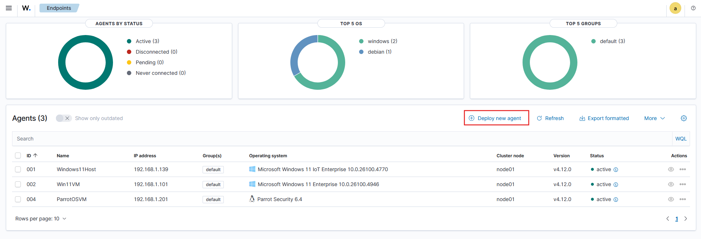

IR Environment Setup

The project must demonstrate successful installation and configuration of Wazuh SIEM platform on Parrot OS (VirtualBox) with evidence of basic agent deployment, log collection configuration from Parrot OS, and creation of 3 custom alert rules for security events. Configuration of Wireshark on Parrot OS must be demonstrated with proper capture filters. Setup must include Volatility framework in Parrot OS with proper memory analysis configuration. System logging must be configured to collect both Parrot OS and macOS logs with evidence of successful ingestion into Wazuh dashboard. All configurations must include proper documentation and evidence of functionality.

Incident Detection and Analysis

The project must include analysis of both Parrot OS and macOS logs using Wazuh, documenting analysis methodology and findings. A detailed investigation of 1 suspicious login attempt must be presented showing log correlation between host and Parrot OS, event timeline creation, and alert validation process. The project must demonstrate classification of 3 distinct security incidents using the taught severity matrix. Analysis must include clear documentation of methodologies used and potential security implications of findings.

Incident Response and Containment

The project must demonstrate network isolation procedures in Parrot OS including network interface configuration, basic firewall rules implementation, and network segmentation using VirtualBox networking. Evidence preservation using Parrot OS forensic tools must be documented for file system artifacts, network traffic captures, and basic memory dumps. A containment playbook must be created showing host isolation steps in VirtualBox, network traffic blocking, and service shutdown procedures. All implementations must include proper documentation and evidence of functionality.

Digital Evidence Management

The project must demonstrate live data collection from Parrot OS showing system state capture, running process information, and network connection data. Basic memory analysis using Volatility in Parrot OS must be performed and documented. Disk acquisition using Parrot OS imaging tools must be demonstrated with proper procedures. Chain of custody documentation must be maintained for all collected evidence. Timeline creation must incorporate both macOS and Parrot OS logs with clear analysis of events.

IR Documentation & Reporting

The project must include creation of an incident response playbook showing response procedures for common incidents, tool-specific commands for Parrot OS, and evidence collection steps. An incident tracking system must be implemented documenting incident details, response actions, and timeline of events. A complete incident report for 1 security event must be created following standard formats. Documentation of all IR tools and procedures in Parrot OS must be maintained with clear explanations of usage.

Post-Incident Procedures

The project must include system recovery procedures for VirtualBox environment restoration, Parrot OS system recovery, and network configuration recovery. A root cause analysis must be performed showing event timeline, contributing factors, and technical findings from Parrot OS tools. A recovery validation checklist with testing procedures must be created and implemented. IR process improvement recommendations must be documented based on lessons learned from the incident response process.

# Incidence Response 1

---

### 1. IR Environment Setup  
- [ ] **1.1** Install and configure **Wazuh Agent** on Parrot OS (VirtualBox)  
- [ ] **1.2** Deploy Wazuh **agent** on Parrot OS with evidence of functionality  
- [ ] **1.3** Configure **log collection** from Parrot OS into Wazuh SIEM Platform 
- [ ] **1.4** Create **3 custom alert rules** for security events in Wazuh  
- [ ] **1.5** Configure and demonstrate **Wireshark** on Parrot OS with capture filters  
- [ ] **1.6** Install and configure **Volatility framework** on Parrot OS for memory analysis  
- [ ] **1.7** Configure **system logging** to collect:  
  - [ ] **1.7a** Parrot OS logs  
  - [ ] **1.7b** macOS logs  
- [ ] **1.8** Demonstrate successful **ingestion into Wazuh dashboard**  
- [ ] **1.9** Provide proper **documentation and evidence** of all configurations  

---

## **1.1** Install and configure **Wazuh Agent** on Parrot OS (VirtualBox) 

- Deploy a new agent in our Wazuh Endpoint Dashboard.
- Then configure this endpoint for windows, linux, or macOS.
- In this case we will configure an agent for `ParrotOSVM` which uses linux, Debian distros (Debx84 specifically.)

---


Wazuh Endpoint Dashboard.

---


Instructions for installing our wazuh agent on our endpoint.

- We select Deb Amd64 since that is the ParrotOS Debian version.
- Our Wazuh SIEM platform is configured on another computer using the IPV4 address `192.168.1.139`.
- In terminal we use the provide command given to us by our Wazuh SIEM platform and this will install and configure the agent seamlessly
- In this process an authentication key is generated which will allow secure ocmmunication between the agent and the wazuh manager.

---

Installation and configuration of wazuh agent.

```bash
wget https://packages.wazuh.com/4.x/apt/pool/main/w/wazuh-agent/wazuh-agent_4.12.0-1_amd64.deb && sudo WAZUH_MANAGER='192.168.1.139' WAZUH_AGENT_NAME='ParrotOSVM' dpkg -i ./wazuh-agent_4.12.0-1_amd64.deb
```

---

### **1.2** Deploy Wazuh **agent** on Parrot OS with evidence of functionality 

- We deploy the wazuh agent by enabling and starting through the given terminal commands. 

```bash
sudo systemctl daemon-reload
sudo systemctl enable wazuh-agent
sudo systemctl start wazuh-agent
```
### 1.3 Configure Log Collection from Parrot OS into Wazuh SIEM Platform

Add log sources in `/var/ossec/etc/ossec.conf`:
```xml
<localfile>
  <log_format>syslog</log_format>
  <location>/var/log/auth.log</location>
</localfile>

<localfile>
  <log_format>syslog</log_format>
  <location>/var/log/syslog</location>
</localfile>
```

Restart agent to apply:
```bash
sudo systemctl restart wazuh-agent
```

---

### 2. Incident Detection and Analysis  
- [ ] **2.1** Analyze both **Parrot OS and macOS logs** using Wazuh  
- [ ] **2.2** Document **analysis methodology** and findings  
- [ ] **2.3** Investigate **1 suspicious login attempt** with:  
  - [ ] **2.3a** Log correlation between host and Parrot OS  
  - [ ] **2.3b** Event timeline creation  
  - [ ] **2.3c** Alert validation process  
- [ ] **2.4** Classify **3 distinct security incidents** using severity matrix  
- [ ] **2.5** Document **methodologies** and **security implications**  

---

### 3. Incident Response and Containment  
- [ ] **3.1** Demonstrate **network isolation procedures** in Parrot OS:  
  - [ ] **3.1a** Network interface configuration  
  - [ ] **3.1b** Basic firewall rules implementation  
  - [ ] **3.1c** Network segmentation in VirtualBox  
- [ ] **3.2** Document **evidence preservation** in Parrot OS:  
  - [ ] **3.2a** File system artifacts  
  - [ ] **3.2b** Network traffic captures  
  - [ ] **3.2c** Memory dumps  
- [ ] **3.3** Create **containment playbook** with:  
  - [ ] **3.3a** Host isolation steps (VirtualBox)  
  - [ ] **3.3b** Network traffic blocking  
  - [ ] **3.3c** Service shutdown procedures  
- [ ] **3.4** Provide proper **documentation and evidence**  

---

### 4. Digital Evidence Management  
- [ ] **4.1** Demonstrate **live data collection** in Parrot OS:  
  - [ ] **4.1a** System state capture  
  - [ ] **4.1b** Running process information  
  - [ ] **4.1c** Network connection data  
- [ ] **4.2** Perform and document **memory analysis** with Volatility in Parrot OS  
- [ ] **4.3** Demonstrate **disk acquisition** with Parrot OS imaging tools  
- [ ] **4.4** Maintain proper **chain of custody documentation** for evidence  
- [ ] **4.5** Create **timeline analysis** combining macOS + Parrot OS logs  

---

### 5. IR Documentation & Reporting  
- [ ] **5.1** Create an **incident response playbook** including:  
  - [ ] **5.1a** Response procedures for common incidents  
  - [ ] **5.1b** Tool-specific commands (Parrot OS)  
  - [ ] **5.1c** Evidence collection steps  
- [ ] **5.2** Implement an **incident tracking system**:  
  - [ ] **5.2a** Incident details  
  - [ ] **5.2b** Response actions  
  - [ ] **5.2c** Timeline of events  
- [ ] **5.3** Create a **complete incident report** for one security event (standard format)  
- [ ] **5.4** Document all **IR tools and procedures** in Parrot OS with clear usage  

---

### 6. Post-Incident Procedures  
- [ ] **6.1** Implement **system recovery procedures**:  
  - [ ] **6.1a** VirtualBox environment restoration  
  - [ ] **6.1b** Parrot OS system recovery  
  - [ ] **6.1c** Network configuration recovery  
- [ ] **6.2** Perform **root cause analysis** with:  
  - [ ] **6.2a** Event timeline  
  - [ ] **6.2b** Contributing factors  
  - [ ] **6.2c** Technical findings from Parrot OS tools  
- [ ] **6.3** Create and implement a **recovery validation checklist** with testing procedures  
- [ ] **6.4** Document **IR process improvement recommendations** based on lessons learned  
