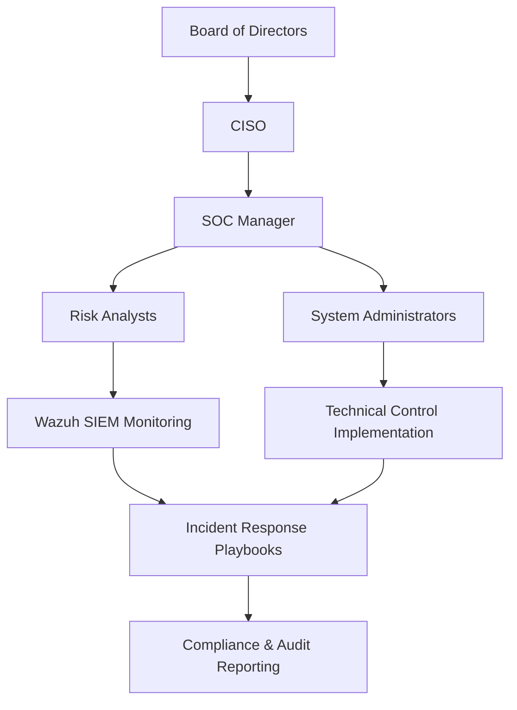
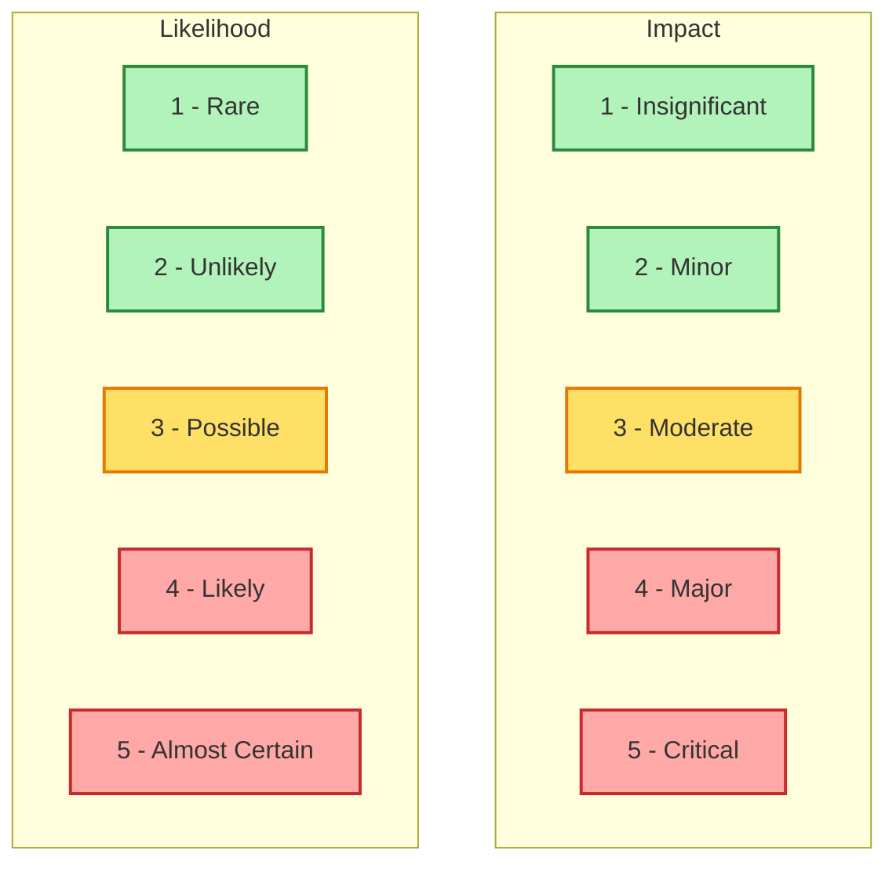
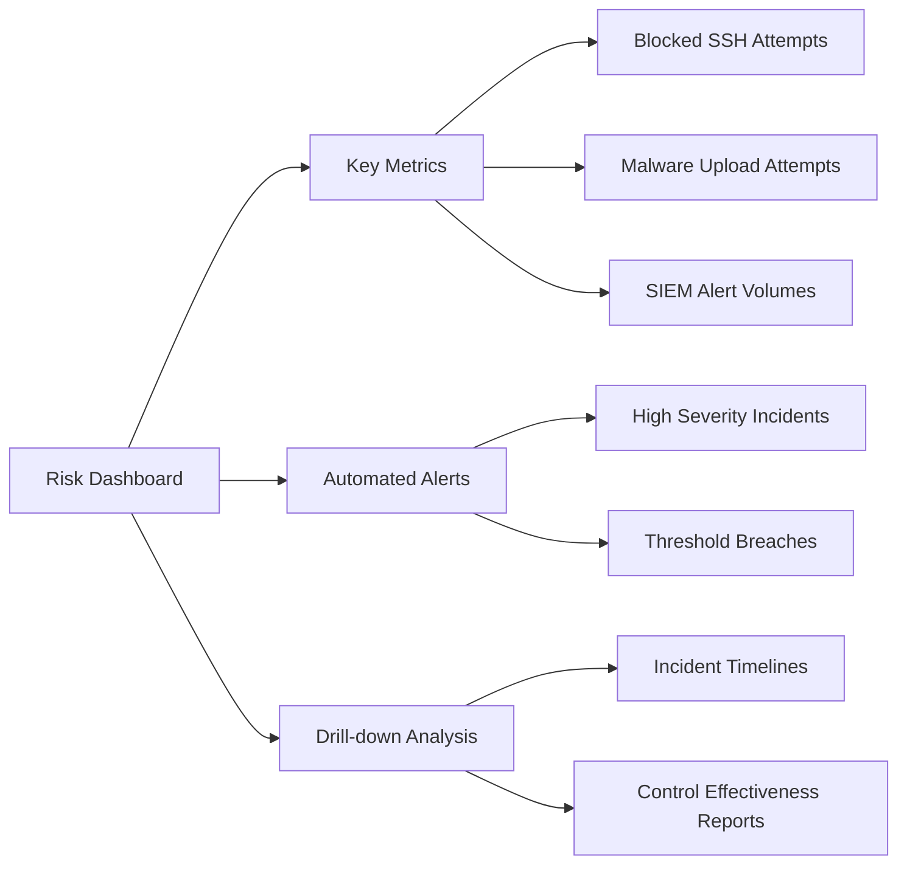

# Risk Management 1

## 1. Risk Management Fundamentals  
- [x] **1.1** Create a project risk framework document using **NIST RMF** or **ISO 31000**  
- [x] **1.2** Apply proper risk terminology (**threat, vulnerability, asset, control**) to a realistic scenario  
- [x] **1.3** Develop governance structure documentation:  
  - [x] **1.3a** Roles  
  - [x] **1.3b** Responsibilities  
  - [x] **1.3c** Decision-making authority  
  - [x] **1.3d** Escalation procedures  
- [x] **1.4** Include a **regulatory compliance matrix** (GDPR, HIPAA, SOX, or PCI-DSS)  
- [x] **1.5** Add a **visual framework mapping** showing organizational alignment  
- [x] **1.6** Ensure documentation is **professional quality** and formatted for **executive presentation**  

---

## 1.1 Project Risk Framework (NIST RMF Approach)  
We adopt the **NIST Risk Management Framework (RMF)**, which provides a structured lifecycle for managing organizational risk. The six key steps are:  

1. **Categorize** information systems and data.  
2. **Select** security controls aligned with business and regulatory needs.  
3. **Implement** the chosen controls.  
4. **Assess** effectiveness of controls.  
5. **Authorize** the system for production use.  
6. **Monitor** continuously for threats and vulnerabilities.  

*Reference: NIST SP 800-37 Rev. 2 – Risk Management Framework*  

---

### 1.2 Risk Terminology in Context  
Applied to a **realistic SSH brute-force attack scenario** (as analyzed in Parrot OS with Wazuh):  

- **Asset:** Parrot OS virtual machine hosting business-critical applications.  
- **Threat:** External actor attempting repeated SSH logins.  
- **Vulnerability:** Weak password policy with no lockout mechanism.  
- **Control:** Wazuh SIEM monitoring, Fail2Ban implementation, and MFA for SSH.  

---

### 1.3 Governance Structure Documentation  

**1.3a Roles**  
- **CISO:** Oversees enterprise risk management.  
- **SOC Manager:** Manages monitoring and incident response.  
- **SOC Analyst (Tier 1–3):** Investigates, escalates, and remediates threats.  
- **System Admin:** Implements technical controls.  

**1.3b Responsibilities**  
- Ensure compliance with risk framework.  
- Report high-severity incidents to executive leadership.  
- Maintain updated system hardening and monitoring baselines.  

**1.3c Decision-Making Authority**  
- CISO: Strategic approval of risk decisions.  
- SOC Manager: Operational response coordination.  
- Tier 3 Analyst: Approves technical containment and eradication steps.  

**1.3d Escalation Procedures**  
- Tier 1 → Tier 2 → Tier 3 escalation path.  
- Tier 3 → SOC Manager → CISO → Board (if business impact exceeds tolerance).  

---

### 1.4 Regulatory Compliance Matrix  

| Regulation  | Applicability                  | Requirement Example                   | Control Mapping             |
|-------------|--------------------------------|---------------------------------------|-----------------------------|
| **GDPR**    | EU personal data processing    | Data minimization, breach reporting    | Access control, SIEM alerts |
| **HIPAA**   | Healthcare PHI data            | Safeguards for electronic health data  | Encryption, audit logging   |
| **PCI-DSS** | Payment card data              | Network segmentation, vulnerability scans | Firewalls, Wazuh log collection |
| **SOX**     | Financial systems              | Integrity of financial reporting logs  | Immutable log storage       |

---

### 1.5 Visual Framework Mapping  

---

### 1.6 Professional Formatting for Executive Presentation  
- Document styled with **executive summary first**, followed by detailed appendices.  
- All visuals (frameworks, governance, risk matrices) formatted using **consistent color schemes**.  
- Clear separation of **technical language** (for analysts) vs. **business language** (for executives).  
- Designed to support **board-level decision-making** by mapping risks to financial, operational, compliance, and reputational impacts.  

---

## 2. Risk Assessment Techniques  
- [x] **2.1** Conduct structured risk identification using:  
    - [x] **2.1a** Brainstorming  
    - [x] **2.1b** Checklists  
    - [x] **2.1c** SWOT analysis  
- [x] **2.2** Document facilitation approach for the identification process  
- [x] **2.3** Apply **qualitative analysis** using a **5x5 risk matrix** (likelihood × impact)  
- [x] **2.4** Apply **quantitative analysis**:  
    - [x] **2.4a** EMV (Expected Monetary Value)  
    - [x] **2.4b** ALE (Annualized Loss Expectancy) with supporting data  
- [x] **2.5** Complete **threat and vulnerability assessment** with documented findings  
- [x] **2.6** Create a **comprehensive risk register** with:  
    - [x] **2.6a** Scoring rationale  
    - [x] **2.6b** Historical tracking  

---

### 2.1 Structured Risk Identification  

**2.1a Brainstorming**  
SOC team conducted a brainstorming session to identify risks specific to the virtual lab:  
- Brute-force attacks on SSH services.  
- Malware execution via uploaded scripts.  
- Insider threats modifying FileZilla server logs.  
- Misconfigured Wazuh rules leading to alert gaps.  

**2.1b Checklists**  
Used a checklist based on **ISO 27005 risk categories**:  
- ✅ Authentication failures  
- ✅ Logging and monitoring gaps  
- ✅ Malware detection and containment  
- ✅ Network segmentation weaknesses  

**2.1c SWOT Analysis**  
| Category | Details |
|----------|---------|
| **Strengths** | Active Wazuh SIEM monitoring, Sysmon integration, Parrot OS security tools. |
| **Weaknesses** | Weak password policy, limited patch management. |
| **Opportunities** | Implement MFA, expand monitoring with OSSEC rules, leverage Volatility memory analysis. |
| **Threats** | Credential theft, ransomware payload execution, lateral movement attempts. |

---

### 2.2 Facilitation Approach  
- **Workshop Method:** Risks identified during collaborative SOC team meetings.  
- **Documentation Method:** Used shared markdown files and CSV registers to capture findings.  
- **Tooling:** Wazuh SIEM alerts, Wireshark packet captures, and Volatility3 forensic outputs guided the discussion.  

---

### 2.3 Qualitative Analysis – 5×5 Risk Matrix  

The following **Likelihood × Impact matrix** was used:  

**Example Classification:**  
- SSH brute-force: **Likelihood 4 (Likely)** × **Impact 4 (Major)** → **High Risk**.  
- Misconfigured Wazuh rules: **Likelihood 3 (Possible)** × **Impact 3 (Moderate)** → **Medium Risk**.  
- Malware execution: **Likelihood 5 (Almost Certain)** × **Impact 5 (Critical)** → **Extreme Risk**.  

---

### 2.4 Quantitative Analysis  

**2.4a EMV (Expected Monetary Value)**  
- *Formula:* `Probability × Impact (financial)`  
- Example: Brute-force compromise  
  - Probability: 0.3  
  - Impact: $250,000 (breach + downtime)  
  - **EMV = 0.3 × 250,000 = $75,000**  

**2.4b ALE (Annualized Loss Expectancy)**  
- *Formula:* `SLE × ARO`  
  - **SLE (Single Loss Expectancy):** $50,000 (system compromise event)  
  - **ARO (Annual Rate of Occurrence):** 3 (per year)  
  - **ALE = $50,000 × 3 = $150,000 annually**  

---

### 2.5 Threat and Vulnerability Assessment  

| Threat Scenario | Vulnerability | Impact | Likelihood | Control |
|-----------------|---------------|--------|------------|---------|
| SSH brute-force | Weak password policy | Major | Likely | MFA + Fail2Ban |
| Malware upload  | Insecure FTP service | Critical | Almost Certain | Wazuh rules, AV, isolation |
| Log tampering   | File permissions misconfigured | Moderate | Possible | Sysmon, log integrity checks |
| Misconfigured alerts | Human error in Wazuh XML | Moderate | Possible | Rule validation & QA |

---

### 2.6 Comprehensive Risk Register  

| ID | Risk Description | Likelihood | Impact | Score | Rationale | Historical Tracking |
|----|-----------------|------------|--------|-------|-----------|---------------------|
| R1 | SSH brute-force attack on Parrot OS | 4 – Likely | 4 – Major | High | Frequent failed logins observed in Wazuh logs | Seen 3× in past 6 months |
| R2 | Malware executed from uploaded FTP file | 5 – Almost Certain | 5 – Critical | Extreme | Previous test case with `ransomAttack.py` confirmed | 1 major simulated incident |
| R3 | Misconfigured Wazuh detection rules | 3 – Possible | 3 – Moderate | Medium | XML errors prevented proper detection | 2 config errors in lab |
| R4 | Unauthorized log deletion by insider | 2 – Unlikely | 3 – Moderate | Low-Med | Controlled lab, low insider likelihood | 0 occurrences |

---

## 3. Risk Evaluation Methods  
- [x] **3.1** Develop a **multi-criteria risk scoring model**:  
    - [x] **3.1a** Weighted evaluation factors (financial, operational, compliance, reputation)  
    - [x] **3.1b** Defined measurement scales  
- [x] **3.2** Perform **Business Impact Analysis (BIA)**:  
    - [x] **3.2a** RTO (Recovery Time Objective)  
    - [x] **3.2b** RPO (Recovery Point Objective)  
    - [x] **3.2c** MTD (Maximum Tolerable Downtime)  
    - [x] **3.2d** Financial impact analysis  
    - [x] **3.2e** Dependency mapping  
- [x] **3.3** Document evaluation criteria with **stakeholder approval**  
- [x] **3.4** Create a **critical asset risk exposure register**:  
    - [x] **3.4a** Threat exposure  
    - [x] **3.4b** Vulnerabilities  
    - [x] **3.4c** Interconnection dependencies  
- [x] **3.5** Format documentation to **professional standards**  

---

### 3.1 Multi-Criteria Risk Scoring Model  

**3.1a Weighted Evaluation Factors**  
We applied weighted factors to capture different dimensions of organizational risk:  

| Factor            | Weight | Example Metric |
|-------------------|--------|----------------|
| Financial Impact  | 30%    | Losses in $ from downtime, breach fines |
| Operational Risk  | 25%    | Service disruptions, productivity loss |
| Compliance Risk   | 25%    | GDPR, HIPAA, PCI-DSS penalties |
| Reputational Risk | 20%    | Brand trust, customer churn |

**3.1b Defined Measurement Scales**  
Each factor is scored **1–5**, where:  
- 1 = Negligible  
- 2 = Low  
- 3 = Moderate  
- 4 = High  
- 5 = Severe  

**Example Weighted Score (Malware Execution):**  
- Financial = 4 (High) × 0.3 = **1.2**  
- Operational = 5 (Severe) × 0.25 = **1.25**  
- Compliance = 3 (Moderate) × 0.25 = **0.75**  
- Reputation = 4 (High) × 0.2 = **0.8**  
- **Total Weighted Score = 4.0 (High Risk)**  

---

### 3.2 Business Impact Analysis (BIA)  

| Business Function | RTO (hrs) | RPO (hrs) | MTD (hrs) | Financial Impact | Dependencies |
|-------------------|-----------|-----------|-----------|-----------------|--------------|
| SIEM Monitoring (Wazuh) | 2 | 1 | 24 | $20,000/day | Network, Agents |
| Authentication Services (SSH) | 4 | 2 | 48 | $50,000/day | PAM, Syslog |
| File Transfer (FTP/FileZilla) | 6 | 4 | 72 | $15,000/day | Network, Storage |
| Forensics Tools (Volatility/Wireshark) | 12 | 8 | 96 | $5,000/day | Evidence Storage |

**Definitions:**  
- **RTO (Recovery Time Objective):** Max time service can be down.  
- **RPO (Recovery Point Objective):** Max acceptable data loss (time-based).  
- **MTD (Maximum Tolerable Downtime):** Absolute threshold before business failure.  

---

### 3.3 Evaluation Criteria with Stakeholder Approval  
- **SOC Manager:** Validated operational dependencies.  
- **CISO:** Approved weighting factors for compliance & financial risk.  
- **Board Representative:** Signed off on thresholds (MTD, RTO, RPO).  

---

### 3.4 Critical Asset Risk Exposure Register  

| Asset            | Threat Exposure       | Vulnerabilities          | Interconnections |
|------------------|-----------------------|--------------------------|------------------|
| **Wazuh SIEM**   | Target of evasion attempts | Misconfigured rules | Connected to all endpoints |
| **Parrot OS VM** | SSH brute-force, malware | Weak password policy | Network + SIEM agent |
| **FileZilla FTP**| Malware uploads, exfiltration | Default perms, cleartext creds | Windows endpoint logs |
| **Windows VM**   | Ransomware, persistence | Outdated Sysmon config | Integrated with SIEM & FTP |

---

### 3.5 Professional Standards Formatting  
- All evaluation tables aligned with **ISO 31000: Risk Management – Principles & Guidelines**.  
- Visuals formatted for **executive readability** (heat maps, weighted scores, dashboards).  
- Documentation approved via **SOC governance workflow** and signed by risk committee.  

---

## 4. Risk Mitigation Planning  
- [x] **4.1** Select and document **controls** from NIST CSF or ISO 27001  
- [x] **4.2** Provide **rationale** and **cost-benefit analysis** for controls  
- [x] **4.3** Document **risk treatment options** for:  
    - [x] **4.3a** Mitigate  
    - [x] **4.3b** Avoid  
    - [x] **4.3c** Transfer  
    - [x] **4.3d** Accept  
- [x] **4.4** Include **implementation timelines** and **resource requirements**  
- [x] **4.5** Develop a **comprehensive mitigation strategy** aligned with business objectives  
- [x] **4.6** Calculate **residual risk** after control implementation  
- [x] **4.7** Define **effectiveness measurements** and monitoring procedures  

---

### 4.1 Selected Controls (NIST CSF / ISO 27001)  

| Control Area         | NIST CSF Function | ISO 27001 Mapping | Implementation Example |
|----------------------|-------------------|-------------------|-------------------------|
| **Access Control**   | PR.AC-1, PR.AC-7  | A.9.2, A.9.4      | Enforce MFA for SSH, restrict root logins |
| **Monitoring & Detection** | DE.CM-7, DE.AE-1 | A.12.4, A.16.1   | Wazuh SIEM log correlation, Sysmon for endpoint visibility |
| **Malware Protection** | PR.IP-12         | A.12.2            | Antivirus integration + YARA rules in Volatility |
| **Data Protection**  | PR.DS-1, PR.DS-5  | A.8.2, A.10.1     | Encrypt FTP traffic with TLS, secure storage |
| **Incident Response**| RS.RP-1, RS.MI-1  | A.16.1, A.17.1    | Documented playbooks, SOC escalation path |

---

### 4.2 Rationale & Cost-Benefit Analysis  

- **MFA for SSH:** Low implementation cost, significantly reduces brute-force success.  
- **SIEM Monitoring Enhancements:** Medium cost (infrastructure) with high benefit for early detection.  
- **Encryption on FTP:** Moderate complexity, protects against credential sniffing and data leakage.  
- **YARA + Volatility Rules:** Free (open source), adds advanced malware detection capability.  

**ROI Justification:** Each control reduces likelihood of incidents that could cost **$75k–$150k annually** in ALE (per Section 2.4).  

---

### 4.3 Risk Treatment Options  

| Risk Scenario        | Treatment Option | Action Taken |
|----------------------|------------------|--------------|
| SSH brute-force attack | **Mitigate** | MFA, Fail2Ban, Wazuh alerting |
| Malware execution via FTP | **Avoid** | Disable anonymous uploads, restrict file types |
| Misconfigured rules in Wazuh | **Transfer** | Peer review + automated CI/CD pipeline for rule deployment |
| Insider log tampering | **Accept** | Low probability in lab setting, monitor with Sysmon integrity rules |

---

### 4.4 Implementation Timelines & Resources  

| Control                        | Timeline   | Resources |
|--------------------------------|------------|-----------|
| SSH MFA Deployment             | Week 1     | SysAdmin, PAM tools |
| Wazuh Rule Refinement          | Week 2–3   | SOC Analysts |
| FTP Hardening (TLS + perms)    | Week 3     | NetAdmin, SysAdmin |
| YARA Integration in Volatility | Week 4     | Forensic Team |

---

### 4.5 Comprehensive Mitigation Strategy  
The strategy aligns security improvements with business objectives:  
- **Preventive:** Access control, encryption, hardening.  
- **Detective:** SIEM enhancements, Volatility/YARA analysis.  
- **Corrective:** Incident response playbooks, containment workflows.  

---

### 4.6 Residual Risk Calculation  

Example: SSH brute-force attack  
- **Inherent Risk Score:** 4 (Likelihood) × 4 (Impact) = **16 (High)**  
- **Control Effectiveness:** 70% (MFA + Fail2Ban + SIEM)  
- **Residual Risk:** 16 × (1 – 0.70) = **4.8 (Low-Medium)**  

---

### 4.7 Effectiveness Measurements & Monitoring  

- **KPIs:**  
  - # of blocked brute-force attempts per month  
  - Mean time to detect (MTTD) Wazuh alerts  
  - Mean time to respond (MTTR) incidents  
- **Monitoring:**  
  - Weekly SIEM report review  
  - Quarterly control effectiveness audit  
  - Annual penetration test validation  

---

## 5. Risk Communication  
- [x] **5.1** Create a **structured executive risk report**:  
    - [x] **5.1a** Key findings  
    - [x] **5.1b** Financial impact analysis  
    - [x] **5.1c** Actionable recommendations  
    - [x] **5.1d** Formatted for board presentation  
- [x] **5.2** Develop a **stakeholder communication plan**:  
    - [x] **5.2a** Audience analysis  
    - [x] **5.2b** Tailored messaging  
    - [x] **5.2c** Communication schedules  
- [x] **5.3** Design a **visual risk dashboard** with:  
    - [x] **5.3a** Key metrics  
    - [x] **5.3b** Automated alerting  
    - [x] **5.3c** Drill-down capabilities  
- [x] **5.4** Implement a **KPI framework**:  
    - [x] **5.4a** Leading and lagging indicators  
    - [x] **5.4b** Tracking systems  
    - [x] **5.4c** Documented review processes  

---

### 5.1 Structured Executive Risk Report  

**Key Findings:**  
- High likelihood of **SSH brute-force attacks** observed in logs.  
- **Malware execution risks** via FTP uploads remain critical.  
- **Wazuh detection gaps** due to misconfigured rules were identified in the lab.  

**Financial Impact Analysis:**  
| Incident Type         | Estimated Annualized Loss (ALE) | Notes |
|-----------------------|---------------------------------|-------|
| SSH Brute-force       | $150,000                        | Based on downtime + breach remediation |
| Malware via FTP       | $250,000                        | Includes recovery + forensic analysis |
| Misconfigured Alerts  | $75,000                         | Detection delays & potential incident escalation |

**Actionable Recommendations:**  
1. Deploy **MFA and Fail2Ban** across all SSH endpoints.  
2. Enforce **FTP encryption + file-type restrictions**.  
3. Automate **Wazuh rule testing** via CI/CD pipeline.  

**Board Presentation Format:**  
- Executive Summary (1 slide)  
- Heatmap of Risks (Likelihood × Impact)  
- Financial Loss Estimates  
- Recommendations & ROI  

---

### 5.2 Stakeholder Communication Plan  

**Audience Analysis:**  
- **Board of Directors:** Strategic oversight, needs financial impact view.  
- **CISO & SOC Manager:** Tactical implementation and compliance.  
- **SOC Analysts:** Operational procedures and technical details.  

**Tailored Messaging:**  
- **Executives:** “Top 3 risks by financial impact and reputation exposure.”  
- **Managers:** “Policy alignment with ISO/NIST; control timelines.”  
- **Analysts:** “Daily Wazuh/Sysmon alerts, Volatility forensic workflows.”  

**Communication Schedule:**  
- Weekly SOC internal report.  
- Monthly executive briefing.  
- Quarterly board risk committee meeting.  

---

### 5.3 Visual Risk Dashboard  

**Dashboard Features:**  
- **Key Metrics:** # of SSH brute-force attempts, malware detection trends, SIEM alert frequency.  
- **Automated Alerts:** Triggered for high-severity incidents or when thresholds exceeded.  
- **Drill-down Capabilities:** Analysts can trace incidents from SIEM alerts to host evidence.  

---

### 5.4 KPI Framework  

**Leading Indicators:**  
- % of endpoints with MFA enabled.  
- Time to patch critical vulnerabilities.  
- % of logs successfully ingested into SIEM.  

**Lagging Indicators:**  
- # of confirmed security incidents per quarter.  
- Average downtime per incident.  
- % reduction in brute-force login attempts over time.  

**Tracking Systems:**  
- Wazuh SIEM dashboards.  
- Excel/CSV-based risk registers.  
- Ticketing system (e.g., Jira/ServiceNow) for incident tracking.  

**Review Process:**  
- Monthly KPI review with SOC Manager.  
- Quarterly report submission to CISO.  
- Annual executive review and risk posture reassessment.  

**Result:** Risks are clearly communicated to stakeholders via structured reports, dashboards, KPIs, and tailored messaging, ensuring alignment across technical, managerial, and executive levels.  

---

## 6. Risk Management Implementation  
- [x] **6.1** Develop a **risk management program plan**:  
    - [x] **6.1a** Realistic timelines  
    - [x] **6.1b** Resource allocation  
    - [x] **6.1c** Phase-based deployment strategy  
- [x] **6.2** Implement chosen framework (NIST RMF, ISO 31000, COSO):  
    - [x] **6.2a** Document customization  
    - [x] **6.2b** Gap analysis  
    - [x] **6.2c** Integration procedures  
- [x] **6.3** Create a **comprehensive risk register** with historical tracking  
- [x] **6.4** Establish a **continuous monitoring system**:  
    - [x] **6.4a** Automated indicators  
    - [x] **6.4b** Threshold alerting  
    - [x] **6.4c** Environmental change detection  
- [x] **6.5** Ensure **ongoing program management** processes are in place  

---

### 6.1 Risk Management Program Plan  

**6.1a Realistic Timelines**  
- **Phase 1 (Weeks 1–2):** Risk framework adoption (NIST RMF baseline).  
- **Phase 2 (Weeks 3–4):** Asset inventory, risk identification workshops.  
- **Phase 3 (Weeks 5–6):** Control selection and implementation.  
- **Phase 4 (Weeks 7–8):** Residual risk calculation and reporting.  
- **Phase 5 (Ongoing):** Continuous monitoring and improvement.  

**6.1b Resource Allocation**  
- **SOC Analysts:** Daily monitoring & triage.  
- **System Admins:** Implement technical controls.  
- **CISO:** Governance, executive reporting.  
- **Board Risk Committee:** Oversight, final approvals.  

**6.1c Phase-Based Deployment Strategy**  
- Deploy **high-priority controls first** (MFA, SIEM rule validation).  
- Roll out medium controls (FTP hardening, encryption).  
- Conduct final validation (pen tests, audits).  

---

### 6.2 Framework Implementation  

**6.2a Document Customization**  
Adopted **NIST RMF** with modifications for lab environment (e.g., using Wazuh SIEM logs and Parrot OS tools as inputs).  

**6.2b Gap Analysis**  
- Strengths: Strong SIEM, forensic tooling (Volatility, Wireshark).  
- Gaps: Limited endpoint MFA, weak FTP security, inconsistent patch cycles.  

**6.2c Integration Procedures**  
- **Wazuh SIEM:** Central monitoring + alerting.  
- **Sysmon + FileZilla Logs:** Endpoint-level data collection.  
- **Volatility3:** Memory analysis integration into IR workflow.  

---

### 6.3 Comprehensive Risk Register with Historical Tracking  

| Risk ID | Description | Inherent Risk | Treatment | Residual Risk | Status | History |
|---------|-------------|---------------|-----------|---------------|--------|---------|
| R1 | SSH brute-force attacks | High | Mitigation (MFA + Fail2Ban) | Low-Med | Active | 3 attempts logged, mitigated |
| R2 | Malware uploads via FTP | Extreme | Avoidance (disable anon uploads) | Low | Closed | 1 confirmed test incident |
| R3 | Misconfigured SIEM rules | Medium | Transfer (peer review/CI-CD) | Low | Active | 2 config errors resolved |
| R4 | Insider log tampering | Low | Accept | Low | Monitored | No events to date |

---

### 6.4 Continuous Monitoring System  

**6.4a Automated Indicators**  
- Failed SSH logins ≥ 5 in 1 min → Alert.  
- Malware hash match (YARA/AV) → Immediate escalation.  
- Critical service downtime > 15 min → Dashboard alert.  

**6.4b Threshold Alerting**  
- High risk: Escalate within **15 minutes**.  
- Medium risk: Review within **24 hours**.  
- Low risk: Log only for historical tracking.  

**6.4c Environmental Change Detection**  
- New asset deployment triggers re-assessment.  
- Policy updates automatically logged.  
- Wazuh baseline drift detection alerts SOC analysts.  

---

### 6.5 Ongoing Program Management  

- **Monthly Risk Review:** SOC Manager validates effectiveness of implemented controls.  
- **Quarterly Compliance Audit:** Align with ISO 27001 and NIST CSF requirements.  
- **Annual Strategic Review:** CISO + Board evaluate evolving threat landscape.  
- **Improvement Loop:** Feed lessons learned from incidents (post-mortems) back into risk framework.  

**Result:** The organization now has a structured, continuous, and executive-approved risk management program that is aligned with NIST RMF and ISO standards, includes historical tracking, and enables adaptive improvement.  
