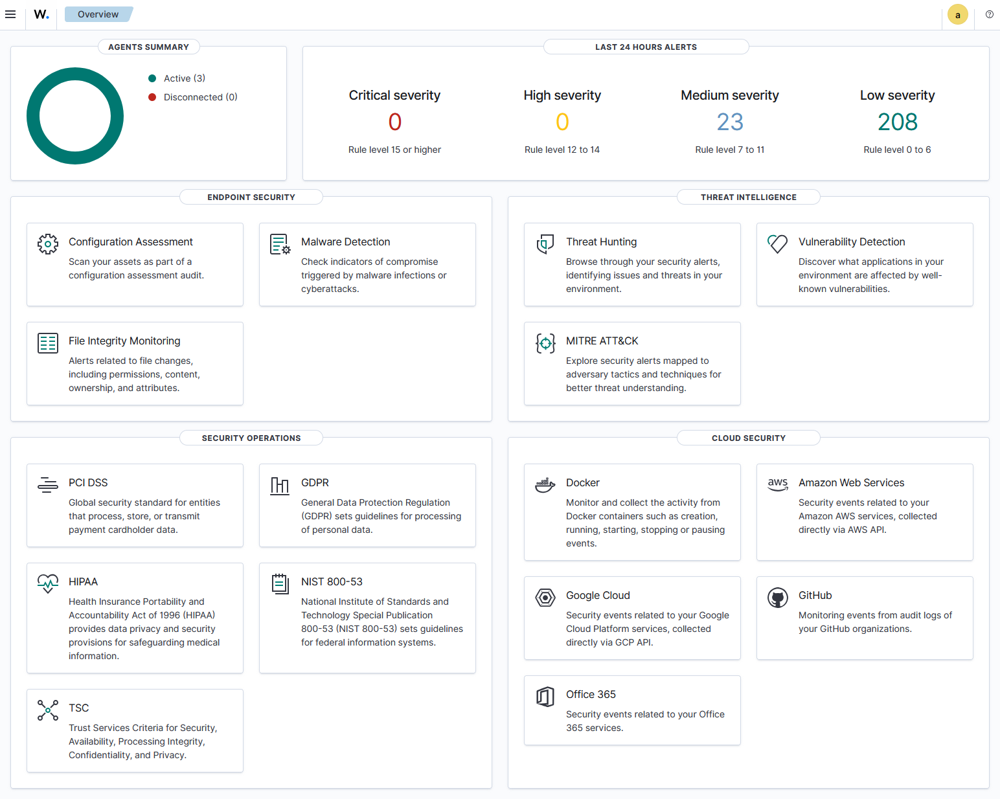

# Security Monitoring 1

# 1. Monitoring Environment Setup Checklist

- [ ] Install and perform basic configuration of a security monitoring platform (Wazuh or similar).  
- [ ] Provide evidence of proper network configuration.  
- [ ] Configure log collection from at least 2 different source types (Windows and Linux).  
- [ ] Verify connectivity from both log sources to the monitoring platform.  
- [ ] Implement alert rules for at least 3 different security scenarios:  
  - [ ] Authentication  
  - [ ] File access  
  - [ ] Network activity  
- [ ] Establish a basic monitoring workflow showing alert routing and notification configurations.  
- [ ] Include screenshots of the monitoring dashboard.  
- [ ] Include screenshots or excerpts of configuration files.  
- [ ] Provide evidence of successful log collection and rule triggering.

### Installation and Basic Configuration

Installation and Basic Configuration
Wazuh Platform Installation
Repository: Wazuh Docker Repository
Prerequisites:

Docker Desktop with WSL2 integration enabled
At least 4GB RAM available for containers
Git installed in WSL environment

Installation Steps:

#### 1. Clone the Wazuh Docker repository and navigate to singe node:

```bash
git clone https://github.com/wazuh/wazuh-docker.git
cd wazuh-docker/single-node
```

#### 2. Generate Wazuh Certificates

```bash
docker-compose -f generate-opendistro-certs.yml run --rm generator
```

#### 3. Run the Wazuh manager using docker

```bash
docker-compose up -d
```

Note: Sometimes some troubleshooting might be required, one problem I had was port 55000 was in use, so I needed to change it to port 56000 within the `docker-compose.yml` located in the `single-node` folder.


#### 4. Log in using default credentials

User: Admin
Password: SecretPassword

#### 5. Access your Dashboard




# 2. Security Event Analysis Checklist

- [ ] Analyze at least 3 different types of security logs.  
- [ ] Provide a clear explanation of interpretation methodology for each log type.  
- [ ] Demonstrate basic correlation between at least 2 different log sources showing related security events.  
- [ ] Develop a complete incident detection scenario including:  
  - [ ] Event timeline  
  - [ ] Correlation of events  
  - [ ] Conclusions  
- [ ] Document alert triage process including:  
  - [ ] Severity assessment  
  - [ ] False positive identification  
  - [ ] Escalation criteria  
- [ ] Include properly annotated log excerpts in documentation.  
- [ ] Interpret findings with clear explanations.  
- [ ] Document investigation methodology used.  

---

# 3. Monitoring Implementation Checklist

- [ ] Create a monitoring architecture diagram showing components and data flows.  
- [ ] Integrate at least 3 different data sources with evidence of successful data collection.  
- [ ] Establish performance baselines for normal operations.  
- [ ] Define clear thresholds for alerting based on baseline measurements.  
- [ ] Configure health monitoring with checks for:  
  - [ ] Collection status  
  - [ ] Processing performance  
  - [ ] Storage utilization  
- [ ] Include configuration files in documentation.  
- [ ] Document integration steps for each data source.  
- [ ] Include baseline measurement results.  
- [ ] Provide documented health check procedures.  

---

# 4. Security Reporting Checklist

- [ ] Document at least 3 different alert types using a standardized template.  
- [ ] Collect security metrics covering:  
  - [ ] Operational metrics  
  - [ ] Coverage metrics  
  - [ ] Effectiveness metrics  
- [ ] Provide clear measurement methodologies for each metric type.  
- [ ] Create a security summary report including:  
  - [ ] Alert trends  
  - [ ] Significant findings  
  - [ ] Recommendations  
- [ ] Implement at least one dashboard showing real-time security status.  
- [ ] Use appropriate visualizations in the dashboard.  
- [ ] Ensure all reporting follows professional standards.  
- [ ] Maintain clear organization, appropriate detail level, and actionable information.  
