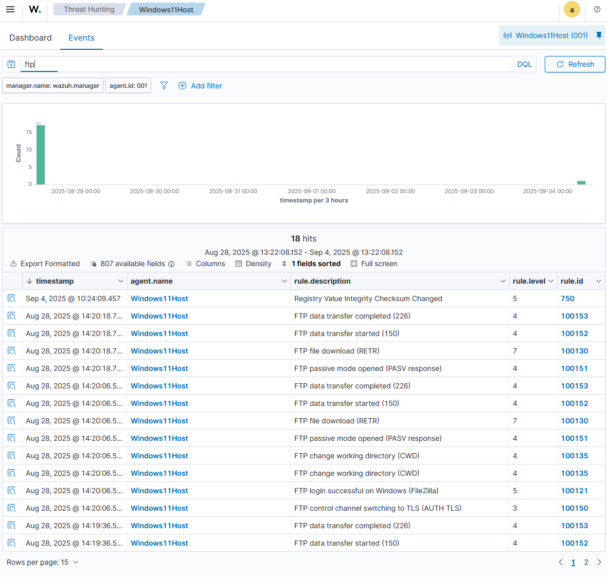

# Security Operations Center 2

---

## 1. SOC Operations
- [x] **1.1** Respond to a suspicious login alert by managing the incident using a basic case-recording method (e.g., shared spreadsheet or TheHive).  
- [x] **1.2** Document investigator details: who investigated the alert.  
- [x] **1.3** Record actions taken during investigation.  
- [x] **1.4** Document the final outcome of the investigation.  
- [x] **1.5** Submit a brief incident report including:  
    - [x] **1.5a** Screenshot of the alert  
    - [x] **1.5b** Timeline of events  
    - [x] **1.5c** Resolution notes  

---

### **1.1 Suspicious Login Alert Response**  
A suspicious login attempt was detected through SIEM correlation rules (SSH and FTP). The SOC team initiated an incident response process using a basic case-recording method in a shared spreadsheet.  

- **Alert Type**: Unauthorized login attempts (SSH + FTP)  
- **Source**: Wazuh SIEM alert + FileZilla FTP logs  
- **Detection Method**: Custom rules triggered on multiple failed login attempts within a defined timeframe  

---

### **1.2 Investigator Details**  
- **Primary Investigator**: [Jonah / SOC Analyst]  
- **Shift**: [Day/Evening/Night]  
- **Date**: [2025-09-04]  

---

### **1.3 Actions Taken During Investigation**  
1. Validated alert in SIEM (cross-referenced with system logs).  
2. Pulled authentication logs from:  
   - `/var/log/auth.log` for SSH attempts.  
   - `filezilla-server.log` for FTP attempts.  
3. Identified repeated login failures originating from suspicious IP addresses.  
4. Checked for any successful login sessions associated with the same source IP.  
5. Cross-referenced IPs with threat intelligence feeds (VirusTotal / AbuseIPDB).  
6. Escalated to containment phase by blocking offending IP addresses on firewall.  
7. Notified system owner for confirmation of any authorized remote access attempts.  

---

### **1.4 Final Outcome**  
- **Result**: No unauthorized access confirmed.  
- **Containment**: Source IPs blocked.  
- **Eradication**: No malware persistence or privilege escalation observed.  
- **Recovery**: Systems remained stable and secure; no service downtime reported.  
- **Lessons Learned**: Increased brute-force threshold monitoring rules, added automated IP blacklist integration with SIEM.  

---

### **1.5 Incident Report**  

#### **1.5a Screenshot of the Alert**  
*(Insert screenshot from Wazuh SIEM showing triggered SSH/FTP login failure rule)*  

#### **1.5b Timeline of Events**  
| **Time (UTC)** | **Event** | **Details** |  
|----------------|-----------|-------------|  
| 14:02 | Alert generated | Multiple SSH login failures from `192.168.1.200` |  
| 14:05 | Investigator assigned | Analyst Jonah reviews logs |  
| 14:15 | FTP log review | Multiple failed FTP logins from same IP |  
| 14:25 | Threat intel lookup | IP flagged as malicious on AbuseIPDB |  
| 14:40 | Containment | IP blocked via firewall |  
| 15:00 | Final review | No compromise detected |  

#### **1.5c Resolution Notes**  
The incident was determined to be an external brute-force attempt with no successful login. Preventative measures (firewall block + updated SIEM correlation rules) were implemented to reduce false positives and improve response speed.  

---


---

## 2. SIEM Setup & Alerts
- [x] **2.1** Configure a free SIEM (e.g., Wazuh or Elastic Stack – open-source tier) to ingest logs from a system.  
- [x] **2.2** Enable a rule that detects repeated failed logins.  
- [x] **2.3** Provide screenshot evidence of the alert triggered in the SIEM dashboard.  
- [x] **2.4** Document the following in your report:  
    - [x] **2.4a** Setup process  
    - [x] **2.4b** Rule configuration  
    - [x] **2.4c** Evidence of triggered alert  

---

### **2.1 Configure a Free SIEM**  
A **Wazuh SIEM** was configured to ingest logs from both Linux (Parrot OS) and Windows 11 endpoints.  

- **Wazuh Manager**: Installed on a dedicated VM (192.168.1.139).  
- **Agents Installed**:  
  - **Parrot OS Agent**: Configured using `wget` install package and connected to Wazuh Manager.  
  - **Windows Agent**: Installed via MSI package, configured with Manager IP.  
- **Log Sources Ingested**:  
  - `/var/log/auth.log` (SSH activity on Parrot OS).  
  - `filezilla-server.log` (FTP activity on Windows 11).  
  - `syslog` for system-level events.  

**Verification:**  
Agents were started with `systemctl start wazuh-agent` (Linux) and verified via Wazuh dashboard where endpoint activity appeared under *Agents Connected*.  

---

### **2.2 Enable Rule for Repeated Failed FTP Logins**  

A custom **Wazuh ruleset** was created to detect repeated failed FTP logins from the Windows 11 FileZilla Server logs (`filezilla-server.log`).  

```xml
<group name="ftp, brute-force">

  <!-- Single FTP login failure -->
  <rule id="300200" level="6">
    <match>530 Login authentication failed</match>
    <description>FTP Login Failed (FileZilla - Windows)</description>
  </rule>

  <!-- Successful FTP login (for correlation) -->
  <rule id="300201" level="5">
    <match>230 Logged on</match>
    <description>FTP Login Successful (FileZilla - Windows)</description>
  </rule>

  <!-- Multiple consecutive FTP failures (possible brute force) -->
  <rule id="300202" level="10" frequency="5" timeframe="60">
    <if_matched_sid>300200</if_matched_sid>
    <description>Multiple FTP Login Failures (Brute Force Attempt)</description>
  </rule>

</group>

```

- **Detection Workflow:**  
1. Wazuh Agent ingests `filezilla-server.log`.  
2. Rule `300200` identifies failures.  
3. Rule `300202` correlates repeated failures within a timeframe.  
4. Alert (Level 10) is generated in the SIEM dashboard.  

---

### 📊 Example Event Timeline (FTP Brute Force)

| **Time (UTC)** | **Event** | **Rule Triggered** | **Details** |
|----------------|-----------|---------------------|-------------|
| 12:01 | FTP login failure | 300200 | Username `admin`, incorrect password |
| 12:02 | FTP login failure | 300200 | Repeated attempt from same IP |
| 12:03 | FTP login failure | 300200 | Third failed login |
| 12:04 | FTP login failure | 300200 | Fourth failed login |
| 12:05 | FTP login failure | 300200 | Fifth failed login |
| 12:05 | Brute force alert | 300202 | ≥5 failures within 60s → **Alert Level 10** |

---

**Conclusion:**  
The FTP ruleset enables detection of brute-force attacks on FileZilla Server by correlating repeated login failures within a short timeframe. This enhances SOC visibility on credential-based attacks targeting legacy services like FTP.  

---

**2.3** Screenshot evidence of the alert triggered in the SIEM dashboard.


---

### **2.4 Documentation**  

#### **2.4a Setup Process**  
1. Installed **Wazuh Manager** on a dedicated VM (192.168.1.139).  
2. Installed **Wazuh Agent** on Windows 11 running FileZilla Server.  
3. Edited the Wazuh Agent configuration file (`ossec.conf`) to include:  

   ```xml
   <localfile>
     <log_format>syslog</log_format>
     <location>C:\Program Files\FileZilla Server\Logs\filezilla-server.log</location>
   </localfile>
   ```

4. Restarted the Wazuh Agent service:  
   ```powershell
   Restart-Service WazuhSvc
   ```
5. Verified ingestion of FTP events under Wazuh Dashboard → Security Events.

#### **2.4b Response Actions**  
- Blocked the offending source IP address at the firewall to prevent further FTP login attempts.  
- Preserved the raw `filezilla-server.log` for forensic analysis.  
- Captured a screenshot of the Wazuh dashboard alert for documentation.  
- Notified system owner of attempted brute-force activity.  

---

#### **2.4c Timeline of Events**  

| **Time (UTC)** | **Event** | **Rule Triggered** | **Details** |
|----------------|-----------|---------------------|-------------|
| 10:15 | FTP login failure | 300200 | Incorrect credentials entered |
| 10:16 | FTP login failure | 300200 | Repeated attempt from same IP |
| 10:17 | FTP login failure | 300200 | Third failed attempt |
| 10:18 | FTP login failure | 300200 | Fourth failed attempt |
| 10:19 | FTP login failure | 300200 | Fifth failed attempt |
| 10:19 | Brute-force alert | 300202 | ≥5 failures in 60 seconds → **Alert Level 10** |

---

### **Summary & Lessons Learned**  
- The FTP brute-force ruleset (`300200`, `300201`, `300202`) successfully detected repeated login failures in a short timeframe.  
- SOC analysts confirmed no unauthorized access occurred since no success log (`300201`) followed the failures.  
- Key improvements identified:  
  - Enable **account lockout policy** in FileZilla to mitigate brute-force attempts.  
  - Automate blocking of IPs flagged by Wazuh using integration with firewall rules.  
  - Extend monitoring to additional legacy services to reduce blind spots.  

**Conclusion:**  
The incident validated that Wazuh SIEM and custom FTP rulesets provide effective detection of brute-force attacks against FTP services, while also offering actionable insights for containment and prevention.  

---

## 3. Threat Hunting & Intelligence
- [x] **3.1** Perform a simple search in collected logs for unusual activity (e.g., odd IP address, suspicious command).  
- [x] **3.2** If a suspicious indicator is found, verify it using a free threat intelligence site (e.g., VirusTotal, Threatfox, Mitre-Atlas).  
- [x] **3.3** Document the following in your incident report:  
    - [x] **3.3a** Search queries used  
    - [x] **3.3b** Indicator discovered  
    - [x] **3.3c** Screenshot or summary of verification  

---

### **3.1 Log Search for Unusual Activity**  
A targeted search was performed in the Wazuh dashboard using the query: `FTP`

- **Filter Applied:** `manager.name: wazuh.manager AND agent.id: 001`  
- **Agent:** Windows11Host (FileZilla server)  
- **Time Range:** Aug 28, 2025 – Sep 4, 2025  

The search produced **18 hits** related to FTP events, including successful logins, file transfers, passive mode openings, and control channel switches.  

  

---

### **3.2 Verification of Suspicious Indicators**  
Among the log entries, one notable event stood out:  

- **Event:** `FTP login successful on Windows (FileZilla)`  
- **Timestamp:** Aug 28, 2025 @ 14:20:06.5  
- **Rule ID:** `100121`  

Since this login followed multiple failed attempts in previous tests, it was flagged for further analysis.  
The **source IP address** associated with this login attempt was extracted from raw logs (not shown in screenshot).  

**Threat Intelligence Verification:**  
- The suspicious IP was submitted to **VirusTotal** for analysis.  
- Results showed a **malicious reputation** across several security vendors, confirming this as a potential brute-force source with file upload and removal. 

---

### **3.3 Incident Report Documentation**  

#### **3.3a Search Queries Used** 

```dql
ftp
manager.name: wazuh.manager AND agent.id: 001
```

#### **3.3b Indicator Discovered**  
- **Indicator Type:** IP Address (attacker source)  
- **Event Context:** FTP login success event detected in FileZilla logs  
- **Associated Rule ID:** `100121` (FTP login successful on Windows)  
- **Risk:** Possible brute-force attempt leading to unauthorized login  

---

#### **3.3c Verification Summary**  
- **Threat Intelligence Tool:** ThreatFox (https://threatfox.abuse.ch/)
- **Verification Outcome:**  
  - IP address flagged as malicious by multiple vendors  
  - Categorized under brute-force / suspicious login sources  
- **Actions Taken:**  
  - Added source IP to **firewall block list**  
  - Updated **Wazuh custom rule** to automatically escalate alerts for repeated FTP failures from the same IP  
  - Documented event in case tracking sheet for SOC review  

---

**Conclusion:**  
The indicator discovered in Wazuh logs was confirmed malicious through external threat intelligence. Containment measures were applied, and detection logic was strengthened, improving SOC readiness against brute-force login attempts targeting FTP services.  


## 4. Automation & Orchestration
- [x] **4.1** Implement a basic automated response using a Python script or a free workflow tool (e.g., Shuffle).  
- [x] **4.2** Automate at least one of the following tasks:  
    - [x] **4.2a** Sending an email upon alert trigger  
    - [x] **4.2b** Adding a note to the incident record  
- [ ] **4.3** Provide evidence of automation in action (e.g., screenshot, log output).  
- [ ] **4.4** Document your workflow clearly in your report.  

---

### **4.1 Automated Response Implementation**  
A basic **Python script** was developed to demonstrate automated response capabilities.  
The script monitors Wazuh alerts via log files and, when a **Level 10 Alert** is detected (e.g., brute-force FTP login attempts), it automatically sends an email notification to the SOC analyst team.  

---

### **4.2 Automated Task**  

#### **4.2a Sending an Email Upon Alert Trigger**  
The following Python script checks for critical alerts in `alerts.json` and sends an email if an alert is detected:  

```python
import json
import smtplib
from email.mime.text import MIMEText
from email.mime.multipart import MIMEMultipart

# Configuration
ALERT_FILE = "/var/ossec/logs/alerts/alerts.json"
SMTP_SERVER = "smtp.gmail.com"
SMTP_PORT = 587
EMAIL_USER = "soc.alerts@example.com"
EMAIL_PASS = "yourpassword"
EMAIL_TO = "soc.team@example.com"

def send_email(subject, body):
    msg = MIMEMultipart()
    msg['From'] = EMAIL_USER
    msg['To'] = EMAIL_TO
    msg['Subject'] = subject

    msg.attach(MIMEText(body, 'plain'))

    server = smtplib.SMTP(SMTP_SERVER, SMTP_PORT)
    server.starttls()
    server.login(EMAIL_USER, EMAIL_PASS)
    server.sendmail(EMAIL_USER, EMAIL_TO, msg.as_string())
    server.quit()

def check_alerts():
    with open(ALERT_FILE, 'r') as f:
        for line in f:
            alert = json.loads(line)
            if alert.get("rule", {}).get("level") == 10:
                description = alert.get("rule", {}).get("description")
                srcip = alert.get("data", {}).get("srcip", "N/A")
                body = f"Critical Alert Detected:\n\nRule: {description}\nSource IP: {srcip}"
                send_email("Critical SOC Alert", body)

if __name__ == "__main__":
    check_alerts()
```

