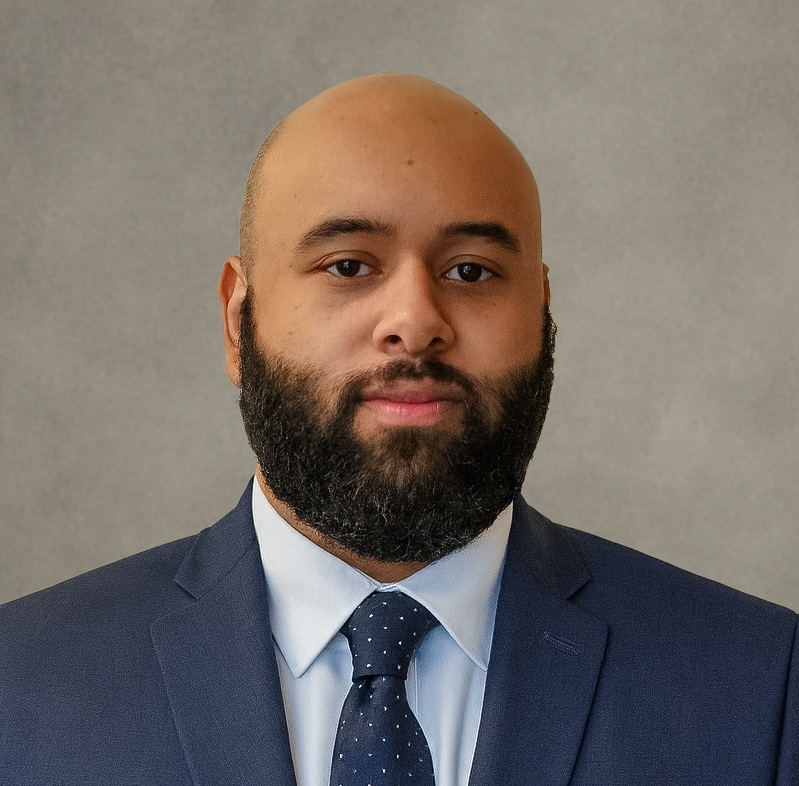

  
  <h1>Welcome to My Portfolio</h1>
  
Cybersecurity Professional | Security Enthusiast | CEO of Boss Inc 

## Expected Graduation

October 2025

## Future Goals

Hey nice to meet you all, I'm Gabe and I'm studying Cyber Security specifcally looking into starting as an SOC Analyst. A little about myself is I consider myself a hands on individual as it's always been the best way I learn and get things done and I look forward to learning as much as I can within the cyber security industry.

My current goal is to be a Security Operations Centre (SOC) Analyst, where as a crucial frontline cyber security professional I will be responsible for monitoring, detecting, analysing, and swiftly responding to cyber threats to safeguard an organisation's networks and valuable data.

I believe in a strong team-based work environment, where we can all work with each other and compliment our strengths and weaknesses. I know that I will definitely shine in a group bringing new insight as a team member.

[Return to Home](./index.md)

{: style="width:120px;"}