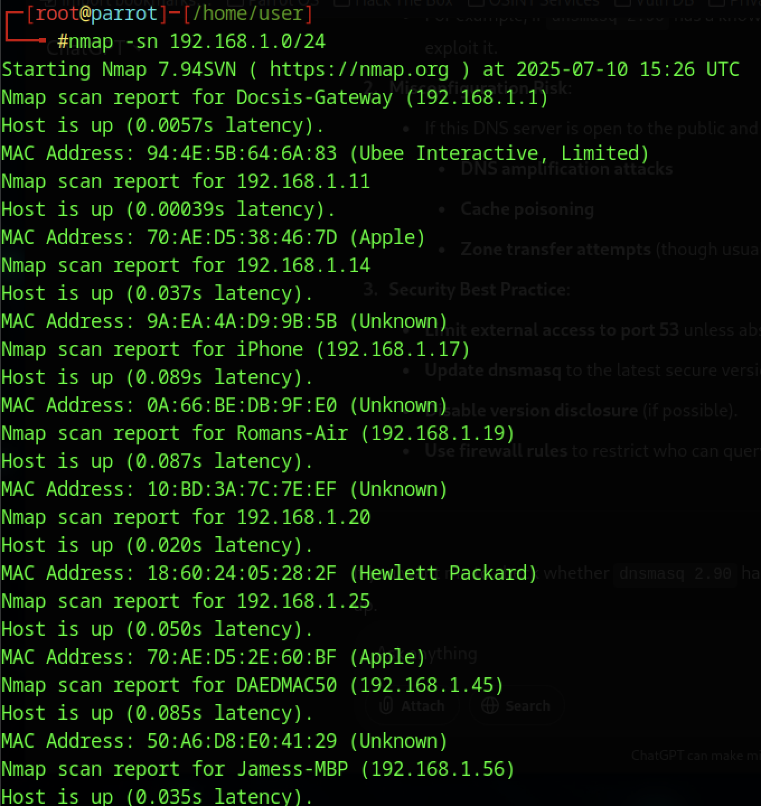
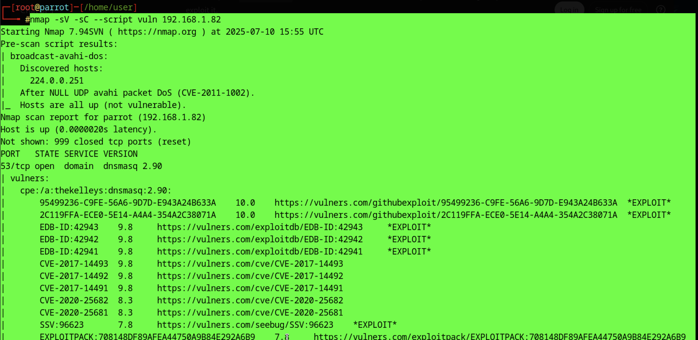
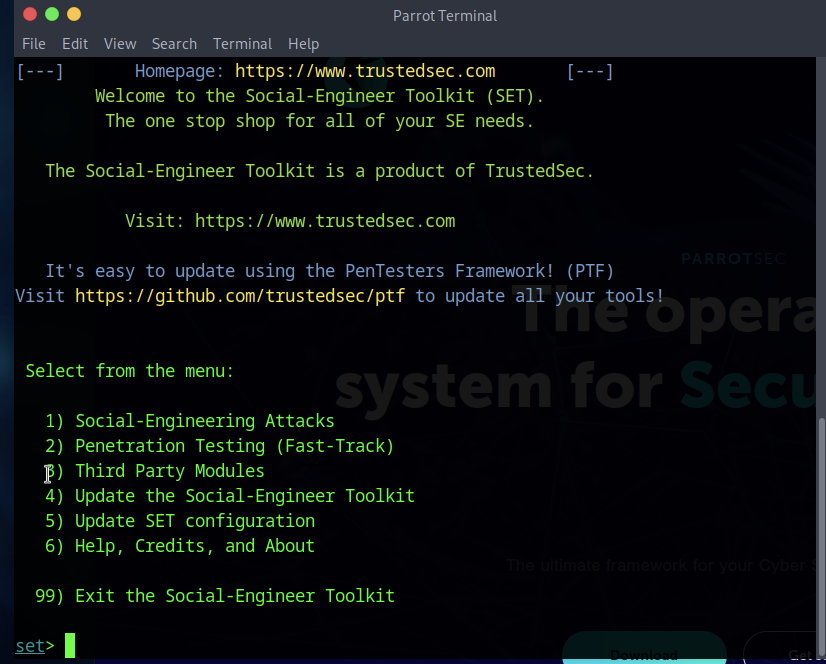
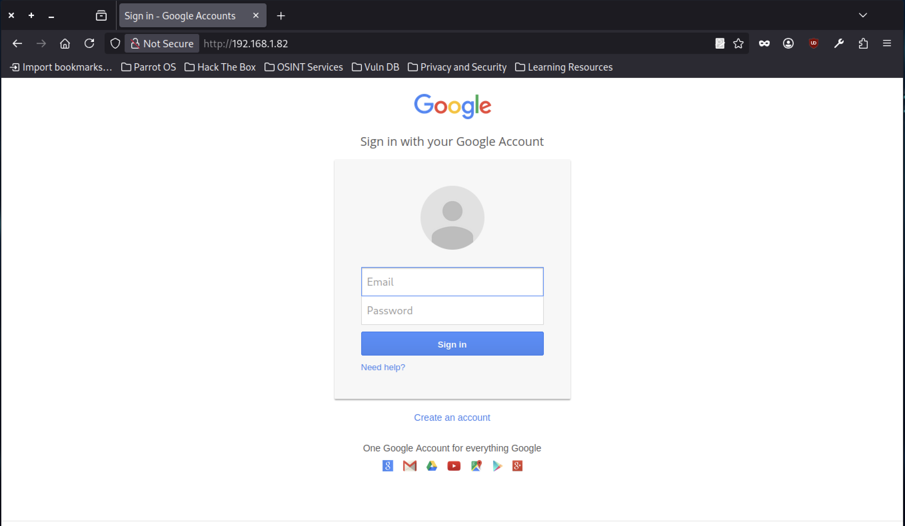
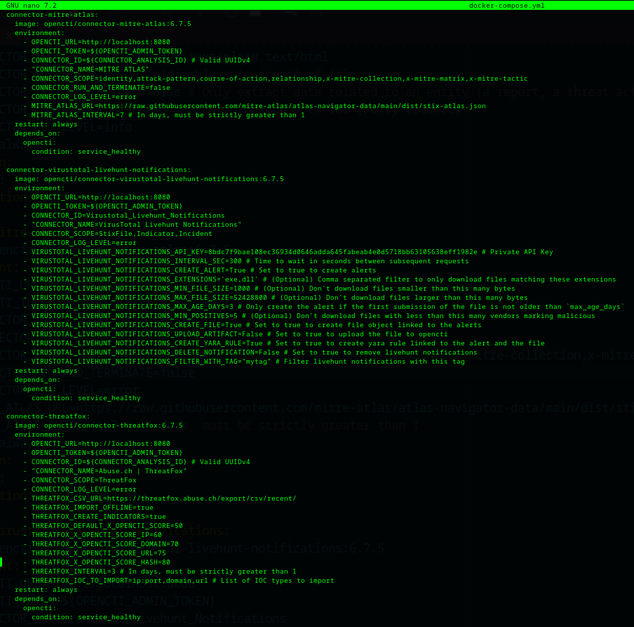
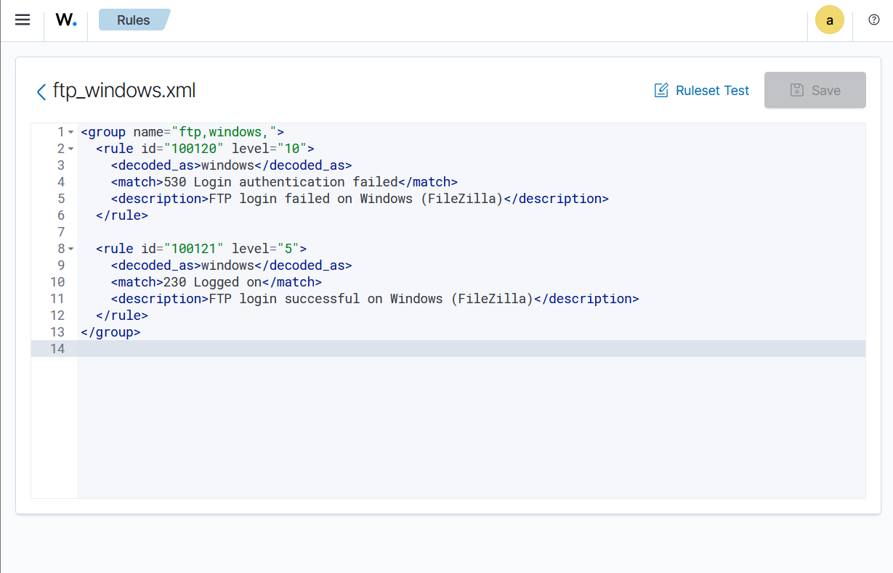

# Cybersecurity Projects Portfolio

This portfolio showcases two interconnected cybersecurity projects that build upon each other. The first project focuses on **designing and deploying a virtual SOC lab**, while the second extends its capabilities by **developing an automated SIEM correlation and attacker timeline reconstruction system**. Together, they demonstrate skills in threat detection, log correlation, automation, and security monitoring.

---

#### Screenshots

### Nmap Vulnerability Scans
<table>
<tr>
<td></td>
<td>Network scan of local subnet using Nmap to identify live hosts and open ports.</td>
</tr>
<tr>
<td></td>
<td>Initial vulnerability scan against target IP showing open DNS service and multiple CVEs.</td>
</tr>
<tr>
<td></td>
<td>Extended vulnerability listing with exploit references from Exploit-DB and Vulners.</td>
</tr>
<tr>
<td></td>
<td>Continued vulnerability enumeration, including CVEs with severity ratings and links.</td>
</tr>
<tr>
<td></td>
<td>Additional service vulnerabilities and exploit metadata gathered via Nmap scripts.</td>
</tr>
</table>

---

### Social-Engineer Toolkit (SET) Attacks
<table>
<tr>
<td></td>
<td>Main menu of the Social-Engineer Toolkit showing attack and testing modules.</td>
</tr>
<tr>
<td></td>
<td>Web attack configuration screen for cloning and harvesting credentials from a target site.</td>
</tr>
<tr>
<td></td>
<td>Phishing page login interface designed for credential capture during testing.</td>
</tr>
<tr>
<td></td>
<td>Captured login page clone showing credential input fields for analysis.</td>
</tr>
<tr>
<td></td>
<td>Alternative phishing login interface variant for testing multi-page workflows.</td>
</tr>
</table>

---

### SIEM & Threat Intelligence Platform
<table>
<tr>
<td></td>
<td>Main dashboard of OpenCTI platform showing threat intelligence workspace.</td>
</tr>
<tr>
<td></td>
<td>List of OpenCTI connectors used for external intelligence integration.</td>
</tr>
<tr>
<td></td>
<td>Terminal output after pulling and starting all OpenCTI services with Docker Compose.</td>
</tr>
<tr>
<td></td>
<td>Custom Wazuh rule for detecting failed FTP logins on Windows using FileZilla.</td>
</tr>
<tr>
<td></td>
<td>Wazuh rules management interface showing applied security rules and compliance checks.</td>
</tr>
</table>

---

## 2. Project 2: Automated SIEM Correlation & Attacker Timeline Reconstruction

**Status:** In Progress  
**Version Control:** [GitHub Repository](#)  
**Tech Stack:** Python, Bash, Wazuh, Elasticsearch, Kibana, Sysmon, Auditd

### Summary
This project enhances the SOC lab by adding an **intelligent SIEM-based system** capable of:
- Automatically correlating log events.
- Identifying Indicators of Compromise (IOCs).
- Generating structured attacker timelines.

### Problem Statement
Security analysts spend significant time manually parsing logs to understand attack sequences.  
This project automates correlation and timeline generation, making threat analysis faster and more accurate.

### Goals
- Build a modular system for multi-stage attack correlation.
- Automatically extract IOCs and generate timelines.
- Implement automated responses for detected threats.

### Key Features
- Centralized log collection from **Windows (Sysmon)** and **Linux (Auditd)**.
- Rule-based correlation using IP, user, and time windows.
- Timeline output in Markdown, CSV, and JSON.
- Optional **auto-response scripts** (e.g., IP blocking).
---

## How They Connect

**Project 1** lays the foundation by building the SOC lab and enabling attack simulations.  
**Project 2** builds on that lab to introduce advanced log correlation, automated attacker timeline creation, and proactive threat response.

---

## Documentation

- **Project 1:** [SOC Lab Setup Guide](#)  
- **Project 2:** [SIEM Correlation System Design Doc](#)  
- **Attack Playbooks:** [Incident Response Plans](#)

---

*All projects are under active version control and documented in accordance with professional cybersecurity project standards.*

<!-- Other page content -->

<html>
<body>
<footer>
    
Thanks for visiting!

    <iframe width="100%" height="166" scrolling="no" frameborder="no" 
        allow="autoplay"
        src="https://soundcloud.com/forrestfrank/lift-my-hands?utm_source=clipboard&utm_medium=text&utm_campaign=social_sharing">
    </iframe>
</footer>
</body>
</html>

