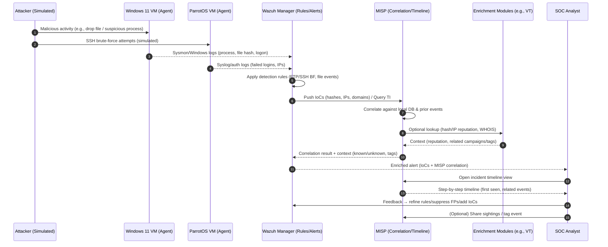

# MISP Integration Plan

**Name:** Gabriel Zepeda  
**Date created:** 2025-09-02  

---

## 📌 Chosen Technology
- **Technology name:** MISP (Malware Information Sharing Platform)  
- **Technology version (if applicable):** Latest stable release  

### Rationale
MISP will be integrated into my SOC virtual lab to **enrich Wazuh alerts with threat intelligence** and support **automated correlation of events**. The main capability it adds is providing **context and historical intelligence** for suspicious activity (files, IPs, domains, hashes). This integration helps speed up triage and incident timeline creation, while still requiring analyst oversight to confirm findings.  

---

## 🎯 Integration Tasks

### Task 1 — Connect Wazuh with MISP
- **Description:** Configure Wazuh to forward selected security events (e.g., file hash, login attempts, IP addresses) to MISP for correlation.  
- **Start date:** 2025-09-03  
- **Target completion date:** 2025-09-09  
- **Success criterion:** Wazuh successfully forwards a test event to MISP, and MISP identifies whether it matches a known IoC.  
- **Proof method:** Screenshot of the event in Wazuh, the correlated result in MISP, and a short log excerpt in `learning/README.md`.  
- **Where I will start Task 1:** local branch `feature/misp-integration`  

---

### Task 2 — Automated Timeline Correlation
- **Description:** Use MISP’s correlation features to automatically generate a timeline of events from Wazuh logs (e.g., brute force attempts leading to malware detection).  
- **Start date:** 2025-09-10  
- **Target completion date:** 2025-09-16  
- **Success criterion:** A visual or textual timeline generated in MISP showing multiple correlated events from a simulated attack.  
- **Proof method:** Exported screenshot of the timeline and correlation view, pasted into `learning/README.md`.  

---

### Task 3 — Enrichment & Reporting
- **Description:** Set up MISP enrichment modules (e.g., hash lookups, threat actor references) so that correlated events include context beyond Wazuh logs.  
- **Start date:** 2025-09-17  
- **Target completion date:** 2025-09-23  
- **Success criterion:** An enriched alert in MISP showing both the original Wazuh data and additional intelligence (e.g., VirusTotal hash reputation).  
- **Proof method:** Screenshot of enriched event in MISP with details saved to `learning/README.md`.  

---

## ⚠️ Risks, Assumptions, and Blockers
- Requires Docker networking between Wazuh containers and MISP container.  
- Needs MISP API keys and possibly public threat feeds enabled.  
- Enrichment modules may require external API access (e.g., VirusTotal, CIRCL).  

---

## 📅 Weekly Timeline
- **Week 1 (Sep 2–8):** Commit this PLAN and complete Task 1 (connect Wazuh to MISP).  
- **Week 2 (Sep 9–15):** Test and implement automated correlation (Task 2).  
- **Week 3 (Sep 16–22):** Add enrichment modules and reporting features (Task 3).  
- **Week 4 (Sep 23–29):** Finalize demos, collect screenshots, and draft reflection documentation.  

## Sequence Diagram 

# Potential Additional Techstacks

## Network Security & Traffic Analysis

- Zeek – advanced network monitoring and protocol analysis.
- Snort – Intrusion detection/prevention engines that complement Wazuh.