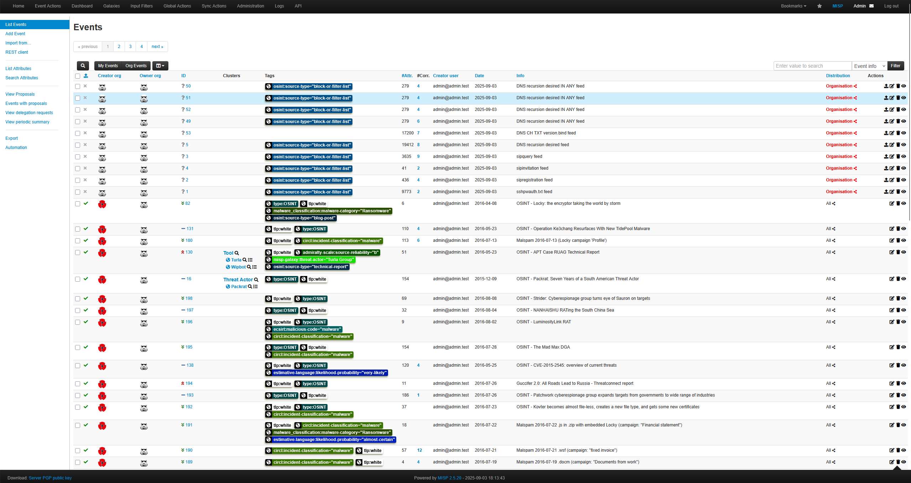

# How do I inetegrate MISP with Wazuh?

**MISP** is short for **Malware Information Sharing Platform** and when paired with a **SIEM (Security Information and Event Manager)** software we can match already caught IoCs from other individuals to the events occuring on our monitored computer systems. 

The SIEM software being used is **Wazuh** which is a free and open source program that when installed will allow us to have a manager and a series of endpoints that are installed on the machines we want to protect. The version of Wazuh we are using can also be setup with **docker-desktop** as a container so when we open docker-desktop it should allow us to open both technologies at the same time.

When MISP is paired with Wazuh it will enrich the logs we are already receiving and will save me time from having to manually look up the information.

---

## Why did I chose MISP?

#### 1. Enhanced Alert Quality & Context
- **Automated IOC enrichment** - Alerts come pre-loaded with threat context instead of requiring manual lookups

#### 2. Faster Incident Response
- **Pre-built threat profiles** - Instant access to known TTPs for faster analysis

#### 3. Workflow Efficiency
- **Automated enrichment** - No manual copy/paste of IOCs for lookups

#### 4. Detection Coverage
- **Community intelligence** - Benefit from threat sharing with other organizations

#### 5. Operational Benefits
- **Reduced alert fatigue** - Better quality alerts mean fewer unnecessary investigations

#### 6. Investigation Support
- **Pivot capabilities** - Jump from one indicator to related threats quickly

Overall it transforms reactive alert processing into proactive, intelligence-driven security operations.

---

## How did I install it?

Since I am using **docker-desktop** already it is best to use **MISP-Docker** which is readily available at **https://github.com/misp/misp-docker** then navigating to the generated directory.

```bash
cd Desktop
git clone https://github.com/misp/misp-docker
cd misp-docker
git docker-compose pull
git docker-compose up
```

---

## What were my largest difficulties?

- Port 443 Error as Wazuh is already using this port, meaning we need to configure MISP to use localhost:444
- Improper build configurations with docker-compose.yml
- Permission errors when trying to build/access certain files and folders

### Port 443 Error & proper build configuration

Due to the fact that my Wazuh Manager was using port 443, it caused installation issues with MISP so I had to change the port to 444. Originally under ports it was `443:443` and was changed to be `444:443`. This way MISP can be utilized under a different port without complications with wazuh.

```text

misp-core:
    image: ghcr.io/misp/misp-docker/misp-core:${CORE_RUNNING_TAG:-latest}

...

    ports:
      - "80:80"
      - "444:443"

...

```

In the .env file change the `BASE_URL` to `https:localhost:444` and add `CORE_RUNNING_TAG=latest` because in the original configuration it contained both an image reference AND a build context in docker-compose.yml:

```test
image: ghcr.io/misp/misp-docker/misp-core:${CORE_RUNNING_TAG:-latest}
build:
  context: core/.
```

### MISP Docker Clean Restart Solution

#### Log File Error

```test
Warning Error: copy(/var/www/MISP/app/Config/config.backup.php): Failed to open stream: Permission denied
```

### Issue
MISP-Docker container failing to start due to permission errors and missing SysLogLogable plugin (however this could be a red herring issue caused by permission errors).

The core issue was file ownership and permissions. Here's what was happening:
The Problem

- Your original directories were created with your user's permissions (likely UID 1000)
- The MISP container runs as `www-data` user (UID 33)
- When the container tried to write configuration files, it got "Permission denied" errors
- This caused the cascade of failures you see in the logs

#### Root Causes
- Incorrect file ownership on mounted volumes
- Docker image/build configuration conflicts
- Corrupted or incomplete directory structures

#### Solution Steps

#### 1. Stop MISP and Clean Docker Environment
```bash
# Stop all MISP services
docker-compose down -v

# Remove any conflicting containers and volumes
docker system prune -f
```

#### 2. Reset Directory Structure
```bash
# Remove existing directories with incorrect permissions
sudo rm -rf configs logs files ssl gnupg

# Recreate empty directories
mkdir -p configs logs files ssl gnupg

# Set correct ownership for MISP container
sudo chown -R 33:33 configs logs files gnupg ssl
```

#### 3. Start MISP Fresh
```bash
# Launch MISP with clean environment
docker-compose up -d
```

##### What This Fixes

##### Container Cleanup
- Removes corrupted containers and volumes
- Clears Docker cache that might contain bad data
- Ensures fresh container state

##### Directory Reset
- Eliminates directories with incorrect permissions
- Creates clean, empty directory structure
- Removes any corrupted configuration files

##### Permission Alignment
The `chown -R 33:33` command sets ownership to match MISP's internal user:
- **33**: UID for `www-data` user inside container
- **33**: GID for `www-data` group  
- **-R**: Applied recursively to all subdirectories

##### Directory Functions
- **configs/**: Database settings, encryption keys, configuration backups
- **logs/**: Application and error logs
- **files/**: Uploaded files, temporary data, cached content
- **gnupg/**: GPG keys for encryption
- **ssl/**: SSL certificates

##### Verification
Check ownership after running the fix:
```bash
ls -la configs logs files gnupg ssl
```
Should show `33 33` or `www-data www-data` as owner.

## Using MISP

#### Log-in

There is a default login username and password already that we will use but can be changed at a later date.

```text

# Username:
admin@admin.test

# Password:
admin

```



